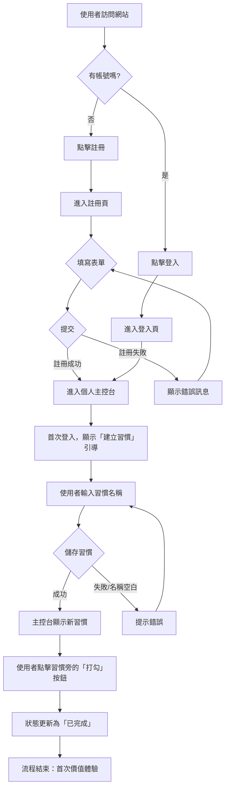

+++
title = "Day 7: 【文件 #2】使用者的旅程：用 Gemini CLI 描繪「使用者故事」"
date = 2025-08-26
slug = "2025iThomeIronmanDay7"
dates = ["2025-08-26"]
tags = ["2025iThomeIronman", "Gemini", "User Stories", "Mermaid", "Agile"]
series = ["2025iThomeIronman"]
categories = ["專案管理"]
weight = 7
prev_post_slug = "2025iThomeIronmanDay6"
next_post_slug = "2025iThomeIronmanDay8"
draft = false
description = "今天，我們將完全在終端機內，描繪這張地圖，產出兩份從「使用者視角」出發的關鍵文件：使用者故事與使用者流程圖。"
+++

安安，我是 ChiYu！

昨天，我們確立了專案的「北極星」——專案章程，並在 GitHub 上留下了第一個不可磨滅的印記。如果說昨天的「專案章程」是我們的**「戰略地圖」，告訴我們為何而戰、要攻下哪座城池。那今天，我們就要化身為「戰場指揮官」，繪製出士兵（使用者）在戰場上的具體「戰術路線圖」**。

今天，我們將完全在終端機內，描繪這張地圖，產出兩份從「使用者視角」出發的關鍵文件：`使用者故事 (User Stories)` 與 `使用者流程圖 (User Flowchart)`。

## Part 1：什麼是「使用者故事」？

別被「故事」這兩個字嚇到，我們不是要寫小說。使用者故事其實是一種在敏捷開發中，用來描述需求的強大工具。

你可以把它想像成你在跟咖啡師點餐。你不會直接跟他說「給我咖啡因、水和牛奶的混合物」，你會說：

> 身為 一個想提神的顧客 (使用者)，
> 
> 我想要 一杯大杯的熱拿鐵 (功能)，
> 
> 以便 讓我有精神撐過下午的會議 (價值)。

看到這個格式的威力了嗎？它強迫我們停止用「工程師的語言」思考，而是用「使用者的語言」思考。一個好的使用者故事，包含了經典的「3C」要素：

- **Card (卡片)**：故事本身簡短扼要，像一張可以貼在牆上的便利貼。
- **Conversation (對話)**：它不是一份冰冷的規格書，而是一個「邀請」，邀請你和 AI 針對這個需求進行對話，釐清細節。
- **Confirmation (確認)**：這是最關鍵的一步！每個故事都應該伴隨著**「驗收條件 (Acceptance Criteria)」**，也就是一個非黑即白、不容狡辯的簡單清單，用來確認「怎樣才算完成了這個故事」。

## Part 2：什麼是「使用者流程圖」與 Mermaid.js？

如果說使用者故事是描述一個個「單點需求」，那「使用者流程圖」就是把這些點串連起來的「路線圖」。它用視覺化的方式，呈現使用者為了完成一個特定目標所需要經過的完整路徑。

一張圖勝過千言萬語，但一張圖配上精闢的文字解說，才能確保所有人對這千言萬語的理解是完全一致的。

而 `Mermaid.js` 就是一個能讓我們用「文字」來畫流程圖的神奇工具。因為是純文字，所以我們可以輕鬆地用 `Git` 進行版本控制，這對開發者來說再方便不過了！

Mermaid的語法我暫時不花太多篇幅作介紹，感覺要介紹可以花一天的文章篇幅來完整介紹，在系列文章結束後我再來補充好了(挖坑給自己)！畢竟`Mermaid.js` 真的有他非常好用的地方，語法簡單直觀、便於版本控制、易於整合與維護而且還跨平台!!!

## Part 3：實戰開始：在終端機中扮演我們的產品經理

好了，理論課結束，讓我們再次召喚 Gemini CLI，請它繼續扮演我們的產品經理。

### Step 1：詠唱我們的魔法 (Craft the Prompt)

我們要讓 Gemini 直接讀取我們本地的「專案章程」，來確保我們的工作是基於最新、最正確的藍圖。

打開 VS Code 終端機，詠唱我們的第二個「文件生成咒語」：

### 【魔法詠唱：我們的 Prompt】

```markdown
# 角色 (Role)
你是一位頂尖的產品經理 (PM)，擁有豐富的敏捷開發經驗，擅長將高階的專案目標，轉化為清晰、可執行的使用者故事與流程。你的產出兼具使用者同理心與技術可行性。

# 目標 (Objective)
我的目標是讓你將一份高階的「專案章程」分解為開發團隊可以立即投入工作的敏捷開發產物 (Agile Artifacts)，包含使用者故事和流程圖。

# 上下文 (Context)
-   **唯一的真相來源 (Single Source of Truth)**: 請將 @docs/PROJECT_CHARTER.md 這份文件作為你所有分析與產出的唯一依據。

---

## 你的任務與產出要求 (Your Task & Output Requirements)

請嚴格按照以下順序與格式，完成所有任務，並將最終結果生成到指定的檔案中。

### 任務 1: 生成核心使用者故事 (Core User Stories)

-   **數量**: 根據專案章程中的 MVP 範圍，撰寫 **5 個最核心**的使用者故事。
-   **聚焦**: 故事應專注於新使用者從註冊到首次體驗到產品核心價值的「關鍵路徑 (Critical Path)」。
-   **格式**:
    -   **使用者故事**: 採用標準格式 `As a [角色], I want to [行為], so that [價值]`。
    -   **驗收標準 (Acceptance Criteria)**: 每個故事必須附上 **3 條**驗收標準。
    -   **AC 語法**: 驗收標準必須採用 Gherkin 語法 `Given-When-Then` 撰寫。

### 任務 2: 生成使用者流程圖 (User Flow Diagram)

-   **目標流程**: 聚焦於「**新使用者從進入網站到完成第一次習慣打卡**」的完整流程。
-   **格式**:
    -   請使用 **Mermaid.js 的 `graph TD` (由上至下圖表) 語法**來生成流程圖。
    -   將 Mermaid 語法完整地包在 ` ```mermaid ... ``` 程式碼區塊中。
    -   節點文字應簡潔，箭頭應清晰表示流程方向與條件分支（例如：成功/失敗）。

### 任務 3: 撰寫流程圖詳細說明 (Detailed Flow Description)

-   在 Mermaid 圖表下方，提供一個名為「**流程圖詳細說明**」的段落。
-   使用有序列表，**逐一解釋**流程圖中每個主要步驟的**「WHY」**。不僅要說明「做了什麼」，更要解釋「**為什麼這樣設計**」，包含背後的使用者動機或業務考量。

### 最終產出指令 (Final Output Command)

-   **文件標頭**: 在文件的最頂部，加上文件版本號 `1.0` 與作者 `Gemini (產品經理)`。
-   **執行動作**: 將以上所有產出（使用者故事、Mermaid 圖表、流程說明）合併到同一個 Markdown 檔案中，命名為 `USER_STORIES.md`，並放置於 @docs\** 資料夾內。
```

### 【指令拆解】

- ` @docs/PROJECT_CHARTER.md`：我們將昨天的產出作為上下文「餵」給 Gemini，讓它的發想有根有據。

### Step 2：迭代與定稿

記住我們的心法：AI 給的永遠是草稿。打開 `docs/USER_STORIES.md`，仔細閱讀。故事是否合理？驗收標準是否清晰？你可以直接修改，或使用 ` @` 指令讓 AI 針對這個檔案進行「原地重構」，直到你得到一份滿意的「定稿」為止。

### Step 3：審核與分析我們的 AI 產出

在你與 AI 經過幾輪的迭代優化後，最終你會得到一份高品質的定稿文件，就像下面這樣：

---

```markdown
- **版本**: 1.0
- **作者**: Gemini (產品經理)

---

## 核心使用者故事 (Core User Stories)

以下是專為「心境軌跡 (MindTrack)」MVP 設計的 5 個核心使用者故事，聚焦於新使用者的關鍵體驗路徑。

### 1. 使用者註冊

**作為一個**新使用者，
**我想要**用我的電子郵件和密碼建立一個帳號，
**這樣我才能**擁有一個個人化且安全的空間來追蹤我的習慣和心情。

**驗收標準 (Acceptance Criteria):**

1.  `假設`我正在註冊頁面，`當`我輸入一個有效的、未被使用的電子郵件和一個安全的密碼，並點擊「註冊」，`那麼`我的帳號應該被成功建立，並且我會自動登入到主控台。
2.  `假設`我正在註冊頁面，`當`我嘗試使用一個已經存在的電子郵件進行註冊，`那麼`我應該會看到一個清晰的錯誤訊息：「此電子郵件地址已被使用。」
3.  `假設`我正在註冊頁面，`當`我輸入一個無效的電子郵件格式（例如：「user @test」）或一個過短的密碼，`那麼`我應該會在對應的欄位旁看到一個即時的驗證錯誤訊息。

### 2. 建立第一個習慣

**作為一個**剛剛登入的初次使用者，
**我希望能**立即被引導去建立我的第一個習慣，
**這樣我才能**快速了解應用的核心功能並開始設定我的目標。

**驗收標準 (Acceptance Criteria):**

1.  `假設`我這是第一次登入，`當`主控台載入完成時，`那麼`畫面上應該會顯示一個彈出視窗或一個顯眼的行動呼籲（CTA）元素，邀請我「建立你的第一個習慣」。
2.  `假設`我被提示要建立一個習慣，`當`我為習慣輸入一個名稱（例如：「每日運動」）並儲存它，`那麼`提示應該會消失，而且新的習慣會被列在我的主控台上。
3.  `假設`我正在建立一個新的習慣，`當`我嘗試在沒有輸入名稱的情況下儲存，`那麼`儲存按鈕應該是不可點擊的，並且會顯示一個錯誤訊息：「習慣名稱不能為空。」

### 3. 每日習慣打卡

**作為一個**回訪使用者，
**我希望能**透過一次點擊就輕易地將一個習慣標記為「今日已完成」，
**這樣我才能**維持一個一致且無阻礙的每日成就記錄。

**驗收標準 (Acceptance Criteria):**

1.  `假設`我的主控台上至少列有一個習慣，`當`我點擊某個習慣旁的空白核取方塊，`那麼`該方塊的狀態應該變為「已勾選」，並且此變更會被儲存。
2.  `假設`我今天已經將一個習慣標記為完成，`當`我再次點擊那個已勾選的方塊，`那麼`該習慣今天的狀態應該會回復到「未完成」。
3.  `假設`我昨天完成了一個習慣，`當`我今天訪問我的主控台時，`那麼`該習慣的核取方塊應該被重設為預設的、未勾選的狀態，為新的一天做好準備。

### 4. 每日心情記錄

**作為一個**專注於自我覺察的使用者，
**我希望能**快速地在一個簡單的量表上記錄我一天的整體心情，
**這樣我才能**建立一個數據集，以便日後發現它與我習慣之間的關聯。

**驗收標準 (Acceptance Criteria):**

1.  `假設`我已經登入到我的主控台，`當`我看到心情記錄區塊並選擇 4 顆星的評分，`那麼`我今天的心情應該被儲存為「4」，並且介面會提供清晰的選擇反饋。
2.  `假設`我今天已經記錄過心情，`當`我選擇一個不同的評分（例如，從 4 顆星改為 2 顆星），`那麼`我今天的心情記錄應該會被更新為新的數值。
3.  `假設`我已經選擇了心情評分，`當`我選擇性地輸入一段文字註記「今天會議很順利」並儲存，`那麼`這段文字應該會與今天的心情記錄關聯起來。

### 5. 查看關聯性洞察

**作為一個**數據導向的使用者，
**我希望能**看到一個簡單的圖表，將我的心情趨勢與我完成的習慣並列視覺化，
**這樣我才能**開始識別我的行為與幸福感之間有意義的模式。

**驗收標準 (Acceptance Criteria):**

1.  `假設`我已經記錄我的心情和至少一個習慣達 3 天或以上，`當`我前往「洞察」頁面，`那麼`我應該會看到一個顯示我心情分數隨時間變化的折線圖。
2.  `假設`我正在查看心情圖表，`當`我在某一天完成了一個特定的習慣，`那麼`在圖表上那天的數據點旁，應該會顯示一個清晰的視覺指標（例如，一個彩色的點）。
3.  `假設`我尚未記錄足夠的數據（例如，少於 3 天的記錄），`當`我訪問「洞察」頁面，`那麼`我應該會看到一條訊息，說明需要更多的數據才能生成洞察報告。

---

## 新使用者首次打卡流程圖



### 流程圖詳細說明

1.  **訪問網站與帳號判斷**: 流程始於使用者到達我們的登陸頁。第一步是區分新舊使用者。
    -   **WHY**: 這是所有 Web 應用的標準起點，提供清晰的註冊或登入路徑，避免使用者混淆。

2.  **註冊流程**: 新使用者需要建立帳號。
    -   **WHY**: 帳號是保存個人化數據（習慣、心情）的基礎，也是實現長期追蹤與留存的必要條件。我們在此設計了失敗迴路，確保使用者能修正錯誤（如已被使用的 Email）並成功註冊。

3.  **首次登入與引導**: 使用者成功登入後，直接進入個人主控台。
    -   **WHY**: 為了盡快讓使用者體驗產品價值（Time to Value），我們在首次登入時主動引導他們執行最關鍵的操作——「建立第一個習慣」。這能有效降低新手的學習曲線，提高使用者激活率。

4.  **建立新習慣**: 使用者被引導去命名並儲存一個他們想追蹤的習慣。
    -   **WHY**: 這是使用者與 App 的第一次有意義的互動。讓使用者輸入自己的目標，能建立個人連結與擁有感，是將抽象目標轉化為具體可追蹤項目的第一步。

5.  **完成首次打卡**: 習慣建立後，它會立即顯示在主控台上，使用者可以點擊完成打卡。
    -   **WHY**: 這是整個關鍵路徑的終點，也是使用者首次體驗到「完成任務」的回饋閉環。這個簡單的點擊動作提供了即時的滿足感，並成功地教會了使用者最核心的日常操作，為他們未來的持續使用奠定了基礎。
```


---

**預覽流程圖：**

> 【小提示】： 想看到 Mermaid 圖表渲染出來的樣子嗎？在 VS Code 市集搜尋並安裝名為 Markdown Preview Mermaid Support 的擴充功能，然後打開 docs/USER_STORIES.md 的預覽模式 (快捷鍵 Ctrl+Shift+V)，欣賞你的文字「程式碼」被即時渲染成的漂亮流程圖！


流程圖長這樣：


單看語法可能會覺得稍微有點亂！但Mermaid語法傳換成流程圖後非常清楚！！！

## Part 4：將使用者地圖存檔 (Commit & Push)


**提交至 GitHub：**

1. 在原始碼管理頁面，對 `docs/USER_STORIES.md` 按 `+` (Stage Changes)。
2. 輸入 Commit 訊息: `docs: Add user stories, ACs, and detailed user flow`
3. 點擊打勾按鈕 (Commit)，然後同步變更 (Push)。

## 結語：戴上使用者的眼鏡

太棒了！這次的 commit，就像是我們在專案地圖上，插上了第一批代表「使用者需求」的旗幟。

今天，我們不只是產品經理，更像是「使用者心理學家」，學會了從他們的角度來思考、規劃、與定義。這份同理心，是 AI 無法取代的，也是區分優秀開發者與普通碼農的關鍵。

有了使用者的視角，下一步，我們就要從天上鳥瞰，規劃我們系統的「鋼筋骨架」了。明天，我們將化身為架構師，與 Gemini 一同討論並設計出我們專案的「軟體架構文件」！
