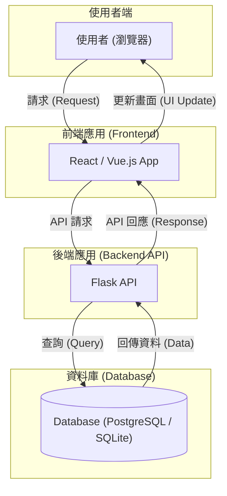

+++
title = "Day 8: 【文件 #3】系統的心臟：用 Gemini CLI 設計「軟體架構文件」"
date = 2025-08-27
slug = "2025iThomeIronmanDay8"
dates = ["2025-08-27"]
tags = ["2025iThomeIronman", "Gemini", "Software Architecture", "Flask", "Blueprints", "Mermaid"]
series = ["2025iThomeIronman"]
categories = ["架構設計"]
weight = 8
prev_post_slug = "2025iThomeIronmanDay7"
next_post_slug = "2025iThomeIronmanDay9"
draft = false
description = "今天，我們要戴上「工程安全帽」，化身為系統架構師，規劃未來系統穩定、高效、可擴展的基石。"
+++

安安，我是 ChiYu！

前兩天，我們完成了專案的「出生證明」(專案章程) 和「使用者地圖」(使用者故事)。我們現在非常清楚「為誰而做」以及「他們想做什麼」。

今天，我們要戴上「工程安全帽」，從使用者的世界暫時抽離，化身為擘劃未來的 **「系統架構師」**。我們要進行一次視角切換，從關注「人」，轉向關注「系統」，回答一個核心問題：「為了滿足這些使用者故事，我們的系統內部應該長什麼樣子？」

我們今天要畫的，不僅是建築的藍圖，更是未來系統穩定、高效、可擴展的基石。

## Part 1：偉大的分工：什麼是「前後端分離」？

在我們深入探討具體的架構之前，你必須先理解現代網頁開發中最核心的一個思想——**前後端分離 (Frontend-Backend Separation)**。

讓我們再次回到「經營一家餐廳」的比喻。一家餐廳，最基本的劃分就是「外場」與「內場」。

- **外場 (前端 Frontend)**：這是顧客能直接接觸到的地方。包含了華麗的裝潢、舒適的座位、精美的菜單、以及親切的服務生。它的唯一職責，就是提供給顧客最棒的「用餐體驗」。在我們的專案中，這對應的就是使用者在瀏覽器上看到的所有畫面，由 `HTML`, `CSS`, `JavaScript` 這三劍客負責打造。
- **內場 (後端 Backend)**：這是神秘的廚房，顧客看不見也摸不著。廚師們在這裡處理訂單、烹飪食物、管理食材庫存。它的唯一職責，就是處理所有核心的「商業邏輯」與「數據管理」。在我們的專案中，這對應的就是運行在遠端伺服器上的 `Python` + `Flask` 應用程式。

「前後端分離」就是一個嚴格的規定：外場的人不准進内場，內場的人也不准跑去外場。他們之間唯一的溝通管道，就是透過「服務生」來傳遞標準化格式的「點餐單」與「餐點」。

## Part 2：溝通的契約：什麼是 API？

這個至關重要的「服務生」，就是我們常說的 `API (Application Programming Interface)`。

API 的本質，就是一份前端與後端之間，神聖不可侵犯的「溝通契約」。這份契約詳細地定義了：

- 前端可以要求後端做哪些事（例如：查詢所有習慣、新增一筆紀錄）。
- 前端在提出要求時，必須提供哪些資訊（例如：新增習慣時要給習慣名稱）。
- 後端在完成任務後，承諾會回傳什麼格式的資料給前端。

有了這份契約，前端的「室內設計師」和後端的「大廚」就可以完全獨立、並行地工作，只要最後雙方都遵守契約，就能完美地將各自的成果組合起來。這份詳細的契約（Web API 規格書），將會是我們在 Day 10 的主題。

## Part 3：設計我們的廚房：Flask 後端 API 伺服器架構

好了，理解了前後端的分工與 API 的角色後，現在我們可以聚焦在「如何設計我們的廚房 (後端)」了。

隨著我們的餐廳生意越來越好，菜色越來越多（功能越來越複雜）時，如果還把所有廚師都擠在一個廚房裡 (`app.py`)，肯定會天下大亂。

因此，我們需要升級成「中央廚房」模式。我們會把廚房細分成「冷盤區」、「熱炒區」、「甜點區」，每個區域有專門的師傅負責。這在我們的後端專案中，就是所謂的**「模組化 (Modularity)」**。

在 `Flask` 框架中，實現模組化的最佳實踐，就是使用**「藍圖 (Blueprints)」**。你可以把一個 `Blueprint` 想像成一個獨立的「功能模組包」。例如，我們可以規劃一個 `habits.py` 檔案，裡面專門放所有跟「習慣」相關的 API 路由。

因此，在我們動手寫 any 一行 `Python` 程式碼之前，我們就要先在這份架構文件中，規劃好我們未來的專案結構。

## Part 4：實戰開始：讓 Gemini 擔任我們的首席架構師

好了，觀念釐清，讓我們再次召喚 Gemini CLI，請它扮演我們的首席架構師。

### 【魔法詠唱：我們的 Prompt】

打開 VS Code 終端機，詠唱我們的第三個「文件生成咒語」：

```markdown
# 角色 (Role)
你是一位資深的軟體架構師，精通 Python Flask 與模組化設計，特別擅長使用 Blueprints 來組織可擴展、可維護的 Web 應用程式。你的設計決策總是兼顧當前的 MVP 需求與未來的擴展性。

# 目標 (Objective)
我的目標是讓你根據專案的初始文件，設計一份專業的「高階設計文檔 (High-Level Design, HLD)」，這份文件將作為開發團隊的技術核心指南。

# 上下文 (Context)
-   **核心依據**: 你的所有設計都必須嚴格基於以下兩份文件：
    1.  `@docs/PROJECT_CHARTER.md` (定義了業務目標與範圍)
    2.  `@docs/USER_STORIES.md` (定義了核心功能與使用者流程)

---

## 你的任務與產出要求 (Your Task & Output Requirements)

你的產出物是一份正式的技術文檔。請嚴格遵循以下大綱結構，確保內容的專業性與完整性。

### 1. 文件元數據 (Document Metadata)
-   **文件標題**: `高階設計文檔 (High-Level Design)`
-   **文件版本**: `v1.0.0`
-   **作者**: `Gemini (軟體架構師)`

### 2. 架構總覽 (Architecture Overview)
-   **核心架構**: 說明我們將採用「**前後端分離 (Headless)**」架構。
-   **設計原則**: 解釋此架構選擇背後的 **3 個主要優點** (例如：獨立開發與部署、技術棧靈活性、更好的擴展性)。
-   **溝通方式**: 強調前後端將透過 **RESTful API** 進行通訊，並以 **JSON** 作為數據交換格式。

### 3. 技術選型與理由 (Technology Stack & Justification)
-   以表格形式，條列出 MVP 階段後端開發所需的核心技術。
-   表格欄位需包含「**技術領域**」、「**選擇**」與「**選擇理由 (WHY)**」。
-   至少需包含以下領域：
    -   Web 框架 (Web Framework)
    -   資料庫 (Database)
    -   ORM (Object-Relational Mapping)
    -   資料驗證 (Data Validation)

### 4. 後端專案結構 (Backend Project Structure)
-   簡要說明採用 **Flask Blueprints** 進行模組化設計的核心目的（關注點分離）。
-   使用文字樹狀圖，清晰地展示推薦的後端專案結構。
-   在樹狀圖的關鍵目錄旁，**用註解簡要說明該目錄的職責** (例如：`blueprints/` 存放各功能模組)。

### 5. 高階架構圖 (High-Level Architecture Diagram)
-   使用 **Mermaid.js 的 `graph TD` 語法**，繪製一張清晰的系統架構圖。
-   圖中必須包含以下四個主要元件及其互動關係：「**使用者 (Client/Browser)**」、「**前端應用 (React/Vue)**」、「**後端 API (Flask)**」、「**資料庫 (PostgreSQL/SQLite)**」。

### 6. 最終產出指令 (Final Output Command)
-   **執行動作**: 將以上所有產出合併到同一個 Markdown 檔案中，命名為 `ARCHITECTURE.md`，並放置於 `@docs` 資料夾內。
```

### 【預期成果與分析】

當你按下 Enter，稍待片刻，Gemini 就會化身為你的首席架構師，產出一份結構清晰、內容專業的軟體架構文件。請仔細審核這份由 AI 生成的草稿，特別是它對「後端專案結構」的規劃，這將是我們後續 Vibe Coding 的重要依據。

---

### 軟體架構文件：習慣養成與心情日誌

以下為 AI 生成的架構文件範例：

#### 1. 架構總覽 (Architecture Overview)

為了實現最大的靈活性與可擴展性，`心境軌跡 (MindTrack)` 將採用**前後端分離 (Headless)** 的現代化架構。

**設計原則與優勢**

此架構的選擇基於以下三個核心優點：

1.  **獨立開發與部署**: 前端與後端團隊可以並行開發、測試及部署，互不阻塞。後端專注於業務邏輯與數據，前端專注於使用者體驗，大幅提升開發效率。
2.  **技術棧靈活性**: 允許我們為工作的不同部分選擇最適合的技術（例如，前端使用 React/Vue，後端使用 Python/Flask）。未來若需升級或替換某一層的技術，對另一層的影響也降至最低。
3.  **多平台擴展性**: 一套統一的後端 API 可以同時服務於目前的 Web 應用、未來的原生行動應用 (iOS/Android) 或其他第三方服務，實現一次開發、多端復用。

**溝通方式**

-   前端與後端之間的所有通訊，將透過標準的 **RESTful API** 進行。
-   數據交換格式統一採用輕量級的 **JSON** 格式。

---

#### 2. 技術選型與理由 (Technology Stack & Justification)

| 技術領域     | 選擇                                  | 選擇理由 (WHY)                                                                                                                                                |
| :----------- | :------------------------------------ | :------------------------------------------------------------------------------------------------------------------------------------------------------------ |
| **Web 框架** | **Flask**                             | 輕量、靈活，擁有龐大的擴充套件生態。非常適合從 MVP 快速啟動，並能隨著業務複雜度平滑擴展。                                                                     |
| **資料庫**   | **SQLite (開發) / PostgreSQL (生產)** | **SQLite** 無需額外設定，極適合作為本地開發資料庫。**PostgreSQL** 功能強大、穩定可靠，是應對生產環境高併發與數據一致性需求的不二之選。                        |
| **ORM**      | **Flask-SQLAlchemy**                  | 作為 Flask 的官方 ORM 套件，它簡化了所有資料庫操作，能有效防止 SQL 注入攻擊，並讓我們能以 Pythonic 的方式與資料庫互動。                                       |
| **資料驗證** | **Flask-Marshmallow**                 | 提供強大的物件序列化 (Serialization) 與反序列化 (Deserialization) 功能，能輕鬆定義清晰的 API 資料結構 (Schema)，並自動完成傳入數據的驗證，確保 API 的健壯性。 |

---

#### 3. 後端專案結構 (Backend Project Structure)

我們將採用 **Flask Blueprints** 來組織專案，將不同功能的程式碼（如認證、習慣管理）封裝到獨立的模組中。這能有效實現「**關注點分離 (Separation of Concerns)**」，讓專案在擴展時依然保持清晰、可維護。

```text
/mindtrack-api
|-- app/                           # 核心應用程式目錄
|   |-- __init__.py                # 應用程式工廠 (App Factory)
|   |-- blueprints/                # 存放所有功能藍圖
|   |   |-- auth/                  # 處理使用者認證 (註冊、登入)
|   |   |   |-- __init__.py
|   |   |   `-- routes.py
|   |   |-- habits/                # 處理習慣與心情的增刪改查
|   |   |   |-- __init__.py
|   |   |   `-- routes.py
|   |   `-- insights/              # 處理數據洞察相關邏輯
|   |       |-- __init__.py
|   |       `-- routes.py
|   |-- models.py                  # SQLAlchemy 資料庫模型
|   |-- schemas.py                 # Marshmallow 資料驗證結構
|   `-- extensions.py              # 集中管理 Flask 擴充套件實例
|-- migrations/                    # 資料庫遷移腳本 (Alembic)
|-- tests/                         # 單元測試與整合測試
|-- config.py                      # 環境設定檔 (開發、生產)
|-- run.py                         # 應用程式啟動入口
`-- .flaskenv                      # Flask 環境變數
```

---

#### 4. 高階架構圖 (High-Level Architecture Diagram)



---

## Part 5：將系統藍圖存檔 (Commit & Push)

預覽架構圖：

在 VS Code 中，打開 ARCHITECTURE.md 的預覽模式 (Ctrl+Shift+V)。看到文字瞬間變成清晰的圖表，這就是**「文件即程式碼 (Docs-as-Code)」**的魅力！

**提交變更：**

1. 在原始碼管理頁面，對 `ARCHITECTURE.md` 按 `+` (Stage Changes)。
2. 輸入 Commit 訊息: `docs: Add software architecture document`
3. 點擊打勾按鈕 (Commit)，然後同步變更 (Push)。

## 結語：從「點子」到「可執行的計畫」

太棒了！今天，我們為專案打下了最穩固的「地基」。我們不只知道要做什麼（使用者故事），更清楚整個系統將如何運作（軟體架構）。有了這份結構藍圖，我們的專案才真正從一個「點子」，進化成了一個「可執行的計畫」。

接下來的兩天，我們將會完成後端藍圖的最後兩塊拼圖。

- 在 **Day 9**，我們將化身為資料庫管理員 (DBA)，設計我們餐廳的「食材倉庫」，產出專業的 **「資料庫綱要 (Database Schema)」**文件。
- 而在緊接著的 **Day 10**，我們則要為我們的「服務生」，設計一份詳盡的「菜單」——也就是 **「Web API 規格書」**！

完成這兩份文件後，我們整個後端的藍圖才算真正大功告成！
