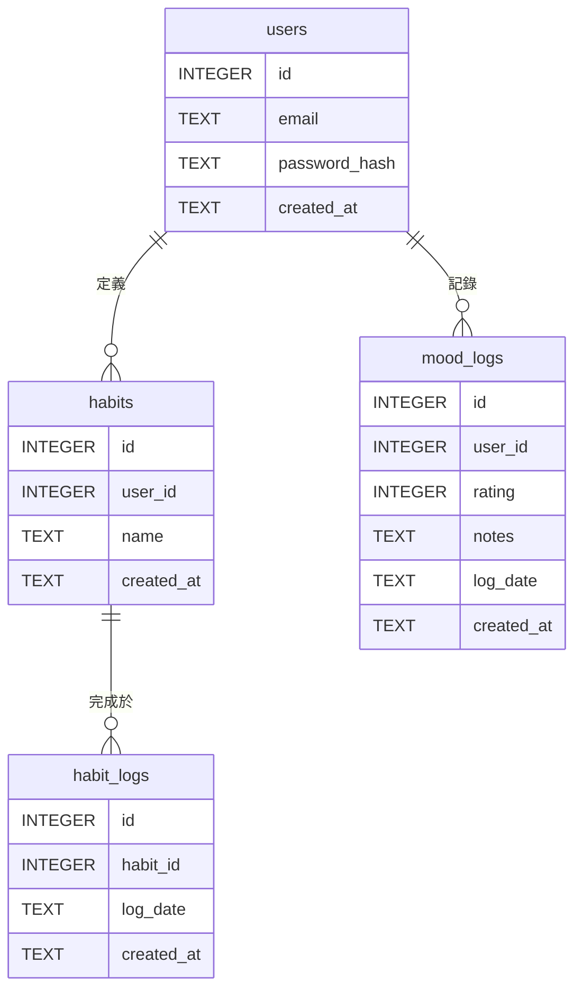

+++
title = "Day 9: 【文件 #4】數據的家：用 Gemini 規劃「資料庫綱要」"
date = 2025-08-28
slug = "2025iThomeIronmanDay9"
dates = ["2025-08-28"]
tags = ["2025iThomeIronman", "Gemini", "Database", "SQLite", "Schema", "Mermaid", "SQL"]
series = ["2025iThomeIronman"]
categories = ["資料庫設計"]
weight = 9
prev_post_slug = "2025iThomeIronmanDay8"
next_post_slug = "2025iThomeIronmanDay10"
draft = false
description = "今天，我們將化身為「數據的守護者」——資料庫管理員 (DBA)，與 Gemini 一同規劃我們專案的「資料庫綱要 (Database Schema)」！"
+++

安安，我是 ChiYu！

昨天，我們化身為架構師，完成了專案的**「系統藍圖」**(軟體架構文件)，釐切了前台、後台、API 與資料庫之間的分工合作關係。

我們的餐廳藍圖畫好了，下一步，就是要來仔細規劃我們儲放所有食材的「食材庫」。在軟體世界裡，這個角色就是由**「資料庫 (Database)」**來扮演。今天，我們將化身為「數據的守護者」——資料庫管理員 (DBA)，與 Gemini 一同規劃我們專案的**「資料庫綱要 (Database Schema)」**！

## Part 1：什麼是「資料庫 (Database)」？

對於新手來說，你可以把資料庫想像成一個擁有超能力的、極度嚴謹的 Excel 表格。它是一個專門用來「結構化儲存」資訊的系統，有非常明確的規則，來確保我們存進去的資料是乾淨、有組織、且易於查詢的。

要理解資料庫，你只需要知道幾個核心概念：

- **資料表 (Table)**：就像 Excel 裡的一個工作表 (Sheet)。
- **欄位 (Column/Field)**：就像工作表裡的第一行標題。
- **紀錄 (Row/Record)**：工作表裡的一行資料。
- **綱要 (Schema)**：這就是整個資料庫的「設計藍圖」。它不僅定義了有哪些資料表、每張表有哪些欄位，更重要的是，它定義了規則：
    - **資料型態 (Data Types)**：規定了每個欄位只能存放哪種類型的資料（數字、文字、日期等）。
    - **約束 (Constraints)**：規定了資料必須遵守的規則，例如 `email` 欄位的內容必須是獨一無二的 (`UNIQUE`)。
    - **關聯 (Relationships)**：定義了表與表之間的連結關係。

我們今天就是要設計這份包含所有規則的「綱要 (Schema)」。

## Part 2：資料庫的兩大門派：SQL vs. NoSQL

在選擇具體的資料庫之前，你需要知道，當今的資料庫世界主要有兩大門派：`SQL` (關聯式資料庫) 和 `NoSQL` (非關聯式資料庫)。

- **SQL** 像 Excel 表格，結構嚴謹，資料之間關係明確，可靠性強。
- **NoSQL** 像一個自由的資料夾，結構靈活彈性，擴展性極強。

對於我們的「習慣養成日誌」專案來說，要儲存的資料關係非常明確：一個「使用者」可以擁有多個「習慣」，一個「習慣」可以擁有多筆「打卡紀錄」。這種層次分明、井然有序的關係，正是 `SQL` 資料庫最擅長處理的。因此，選擇 `SQL` 陣營是我們最穩健的選擇。

## Part 3：選擇我們的資料庫：為什麼是 SQLite？

在 `SQL` 這個門派裡，有許多知名的武林高手。但對於新手和中小型專案，我們選擇一個更輕巧、更友善的方案：**SQLite**。

選擇 `SQLite` 的理由非常充分：**零設定、單一檔案、Python 內建支援**。它能讓你專注在「資料庫設計」本身，而不用分心去處理複雜的環境設定，是學習資料庫觀念的最佳起點。

## Part 4：實戰開始：讓 Gemini 成為我們的資料庫管理員 (DBA)

理論課結束，讓我們再次召喚 Gemini CLI，請它扮演我們的 DBA。

### Step 1：詠唱我們的魔法 (Craft the Prompt)

資料庫的設計，必須要能滿足使用者的需求。因此，最重要的參考文件，就是我們的「使用者故事」。

打開 VS Code 終端機，詠唱我們的第四個「文件生成咒語」：

### 【魔法詠唱：我們的 Prompt】

```markdown
# 角色 (Role)
你是一位專業的資料庫管理員 (DBA)，擁有十年以上的經驗，專長是根據應用程式的需求，設計出高效、正規化且具備良好擴展性的關聯式資料庫綱要 (Database Schema)。

# 目標 (Objective)
我的目標是讓你根據專案的完整上下文，生成一份生產級別的「資料庫綱要定義文檔 (Database Schema Definition Document)」，並提供可執行的 SQL 腳本。

# 上下文 (Context)
-   **核心依據**: 你的所有設計都必須嚴格基於以下三份文件所描述的業務邏輯與功能需求：
    1.  `@docs/PROJECT_CHARTER.md`
    2.  `@docs/USER_STORIES.md`
    3.  `@docs/ARCHITECTURE.md`

---

## 你的任務與產出要求 (Your Task & Output Requirements)

請生成一份專業的 Markdown 文件，並嚴格遵循以下大綱結構與要求：

### 1. 文件元數據 (Document Metadata)
-   **文件標題**: `資料庫綱要定義文檔`
-   **文件版本**: `v1.0.0`
-   **作者**: `Gemini (資料庫管理員)`

### 2. 設計原則與選型 (Design Principles & Engine)
-   **正規化 (Normalization)**: 簡要說明本次設計將遵循**第三正規化 (3NF)**，以確保資料的完整性並減少冗餘。
-   **資料庫引擎**: 確認將使用 **SQLite**，並說明其適合 MVP 階段的 1-2 個理由（例如：輕量、零配置、易於整合）。

### 3. 資料表定義 (Table Definitions)
-   根據上下文，為所有必要的核心實體設計資料表。
-   **重要提示**: 請將「習慣的定義」與「習慣的完成紀錄」拆分為兩個獨立的資料表，以實現多對多關係的追蹤。
-   為每一個資料表提供以下內容：
    -   **用途說明**: 一句話描述該資料表的核心職責。
    -   **欄位詳解 (Markdown 表格)**:
        -   表格欄位必須包含: `欄位名稱`, `資料類型 (SQLite)`, `約束/索引 (PK, FK, UNIQUE, NOT NULL, INDEX)`, `欄位描述`。
        -   對於常用的查詢欄位（例如 `users.email`），請加上 `INDEX` 以提升效能。

### 4. 實體關係圖 (Entity-Relationship Diagram - ERD)
-   在所有資料表定義之後，使用 **Mermaid.js 的 `erDiagram` 語法**，生成一個清晰的 ERD。
-   圖表需明確展示所有資料表及其主鍵、外鍵和關係基數（例如：`||--o{` 代表一對多）。

### 5. 關聯文字說明 (Relationship Description)
-   在 ERD 圖表下方，使用文字簡要說明各個核心資料表之間的關聯（例如：`users` 與 `habits` 之間是一對多關係）。

### 6. 資料庫填充腳本 (Database Seeding Script)
-   提供一段 **SQL 程式碼**，用於向所有資料表中插入 **2-3 筆**有意義的範例資料。
-   這段腳本應能讓開發者在建立資料庫後立即執行，以進行測試。
-   將 SQL 程式碼完整地包在 ` ```sql ... ``` 程式碼區塊中。

### 7. 最終產出指令 (Final Output Command)
-   **執行動作**: 將以上所有產出合併到同一個 Markdown 檔案中，命名為 `DATABASE_SCHEMA.md`，並放置於 `@docs` 資料夾內。
```

### Step 2：迭代與分析我們的 AI 產出

老規矩，AI 給的永遠是草稿。在你與 AI 經過幾輪的迭代優化後（例如，你可以用 `@` 指令請它新增一個 `user_settings` 表），最終你會得到一份高品質的定稿文件，就像下面樣：

---

### 生成的範例文件:

```markdown
### 資料庫文件
- **文件標題**: 資料庫綱要定義文檔
- **文件版本**: v1.0.0
- **作者**: Gemini (資料庫管理員)

---

## 1. 設計原則與選型

#### 正規化 (Normalization)

本次資料庫設計嚴格遵循**第三正規化 (3NF)**。所有資料表的欄位都直接且唯一地依賴於該表的主鍵，旨在消除資料冗餘、保證數據一致性，並提升資料庫的長期可維護性。

#### 資料庫引擎

-   **選型**: **SQLite**
-   **選擇理由**: 
    1.  **輕量級與零配置**: SQLite 是一個無伺服器的資料庫引擎，直接以單一檔案形式存在，無需安裝或設定，極大地簡化了開發環境的搭建與部署流程。
    2.  **易於整合與測試**: 作為一個 C 語言函式庫，它可以輕鬆嵌入到 Python 應用程式中，非常適合專案的 MVP (最小可行性產品) 階段快速迭代與進行單元測試。

---

## 2. 資料表定義 (Table Definitions)

以下是為 `心境軌跡 (MindTrack)` 專案設計的核心資料表。

### `users` (使用者表)
- **用途說明**: 儲存應用程式的使用者帳號基本資料與憑證。

| 欄位名稱        | 資料類型 (SQLite) | 約束/索引                     | 欄位描述                                            |
| :-------------- | :---------------- | :---------------------------- | :-------------------------------------------------- |
| `id`            | `INTEGER`         | `PK`, `AUTOINCREMENT`         | 使用者唯一識別碼                                    |
| `email`         | `TEXT`            | `UNIQUE`, `NOT NULL`, `INDEX` | 使用者註冊信箱，建立索引以加速登入查詢              |
| `password_hash` | `TEXT`            | `NOT NULL`                    | 使用 bcrypt 加密後的密碼雜湊值                      |
| `created_at`    | `TEXT`            | `NOT NULL`                    | 帳號建立時間 (ISO 8601 格式: `YYYY-MM-DD HH:MM:SS`) |

### `habits` (習慣定義表)
- **用途說明**: 儲存使用者自定義的、想要追蹤的習慣項目。

| 欄位名稱     | 資料類型 (SQLite) | 約束/索引                  | 欄位描述                                       |
| :----------- | :---------------- | :------------------------- | :--------------------------------------------- |
| `id`         | `INTEGER`         | `PK`, `AUTOINCREMENT`      | 習慣唯一識別碼                                 |
| `user_id`    | `INTEGER`         | `FK(users.id)`, `NOT NULL` | 關聯至 `users` 表，表示該習慣的擁有者          |
| `name`       | `TEXT`            | `NOT NULL`                 | 習慣的名稱，例如「晨間運動」、「閱讀 30 分鐘」 |
| `created_at` | `TEXT`            | `NOT NULL`                 | 習慣建立時間 (ISO 8601 格式)                   |

### `habit_logs` (習慣完成紀錄表)
- **用途說明**: 記錄使用者在特定日期完成了哪個習慣，實現打卡功能。

| 欄位名稱     | 資料類型 (SQLite) | 約束/索引                    | 欄位描述                                 |
| :----------- | :---------------- | :--------------------------- | :--------------------------------------- |
| `id`         | `INTEGER`         | `PK`, `AUTOINCREMENT`        | 紀錄的唯一識別碼                         |
| `habit_id`   | `INTEGER`         | `FK(habits.id)`, `NOT NULL`  | 關聯至 `habits` 表，表示完成的是哪個習慣 |
| `log_date`   | `TEXT`            | `NOT NULL`                   | 完成習慣的日期 (`YYYY-MM-DD` 格式)       |
| `created_at` | `TEXT`            | `NOT NULL`                   | 紀錄建立時間 (ISO 8601 格式)             |
|              |                   | `UNIQUE(habit_id, log_date)` | 唯一約束，確保同一個習慣一天只能打卡一次 |

### `mood_logs` (心情紀錄表)
- **用途說明**: 記錄使用者在特定日期的心情分數與相關筆記。

| 欄位名稱     | 資料類型 (SQLite) | 約束/索引                   | 欄位描述                                     |
| :----------- | :---------------- | :-------------------------- | :------------------------------------------- |
| `id`         | `INTEGER`         | `PK`, `AUTOINCREMENT`       | 紀錄的唯一識別碼                             |
| `user_id`    | `INTEGER`         | `FK(users.id)`, `NOT NULL`  | 關聯至 `users` 表，表示該心情紀錄的擁有者    |
| `rating`     | `INTEGER`         | `NOT NULL`                  | 心情評分 (1-5 的整數)                        |
| `notes`      | `TEXT`            | `NULLABLE`                  | 對當天心情的選填文字描述                     |
| `log_date`   | `TEXT`            | `NOT NULL`                  | 記錄心情的日期 (`YYYY-MM-DD` 格式)           |
| `created_at" | `TEXT`            | `NOT NULL`                  | 紀錄建立時間 (ISO 8601 格式)                 |
|              |                   | `UNIQUE(user_id, log_date)` | 唯一約束，確保一個使用者一天只能記錄一次心情 |

---

## 3. 實體關係圖 (Entity-Relationship Diagram - ERD)



## 4. 關聯文字說明

-   **users 與 habits**: 一對多 (`1-to-Many`) 關係。一個使用者可以定義多個不同的習慣。
-   **users 與 mood_logs**: 一對多 (`1-to-Many`) 關係。一個使用者可以有多筆每日心情紀錄。
-   **habits 與 habit_logs**: 一對多 (`1-to-Many`) 關係。一個已定義的習慣可以有多筆完成紀錄（每天一筆）。

---

## 5. 資料庫填充腳本 (Database Seeding Script)

以下 SQL 腳本可用於初始化資料庫並填充範例資料，方便開發與測試。

```sql
-- 清除舊資料 (可選)
DELETE FROM mood_logs;
DELETE FROM habit_logs;
DELETE FROM habits;
DELETE FROM users;

-- 填充 `users` 表
INSERT INTO users (id, email, password_hash, created_at) VALUES
(1, 'alice@example.com', 'hashed_password_1', '2025-08-25 10:00:00'),
(2, 'bob@example.com', 'hashed_password_2', '2025-08-25 10:05:00');

-- 填充 `habits` 表 (Alice 的習慣)
INSERT INTO habits (id, user_id, name, created_at) VALUES
(1, 1, '每日運動 30 分鐘', '2025-08-25 10:10:00'),
(2, 1, '閱讀 10 頁書', '2025-08-25 10:11:00');

-- 填充 `habits` 表 (Bob 的習慣)
INSERT INTO habits (id, user_id, name, created_at) VALUES
(3, 2, '練習冥想 15 分鐘', '2025-08-25 10:15:00');

-- 填充 `habit_logs` 表 (打卡紀錄)
INSERT INTO habit_logs (habit_id, log_date, created_at) VALUES
(1, '2025-08-23', '2025-08-23 20:00:00'), -- Alice 運動
(1, '2025-08-24', '2025-08-24 20:05:00'), -- Alice 運動
(2, '2025-08-24', '2025-08-24 22:00:00'), -- Alice 閱讀
(3, '2025-08-24', '2025-08-24 08:00:00'); -- Bob 冥想

-- 填充 `mood_logs` 表
INSERT INTO mood_logs (user_id, rating, notes, log_date, created_at) VALUES
(1, 5, '運動完感覺很好！', '2025-08-23', '2025-08-23 21:00:00'),
(1, 4, '有點累，但還是讀完書了。', '2025-08-24', '2025-08-24 22:30:00'),
(2, 5, '冥想讓一天有個平靜的開始。', '2025-08-24', '2025-08-24 09:00:00');

```
```


## Part 5：建立本地資料庫檔案與文件

### Step 1：建立一個空的資料庫檔案

我們要在專案的根目錄（與 `docs` 資料夾同層）建立一個空的資料庫檔案。這一步就像是我們買了一本全新的、精裝的帳本，外面看起來很漂亮，但裡面還沒有任何內容。

在 VS Code 的檔案總管中，對著根目錄的空白處按右鍵，選擇「New File」，並將檔案命名為 `database.db`。

### Step 2：提交至 GitHub

在原始碼管理頁面，你會看到 `DATABASE_SCHEMA.md` 和 `database.db` 這兩個新檔案。將它們都按 `+` (Stage Changes)。

輸入 Commit 訊息: `docs: Add database schema and create empty db file`

點擊打勾按鈕 (Commit)，然後同步變更 (Push)。

## 結語：數據的家，基石已定

太棒了！這次的 commit，代表著我們專案的**「數據地基」**已經正式打樁完成！

有了這份資料庫藍圖，我們後端藍圖的規劃就只剩下最後一塊，也是與外界溝通最關鍵的一塊拼圖了。明天，我們要交給「服務生 (API)」一份精準的「菜單」，讓他知道如何跟廚房溝通。我們將產出後端開發最重要的契約——**「Web API 規格書」**！
