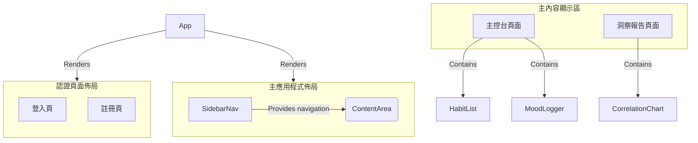

+++
title = "Day 19: 【文件 #7】頁面的骨架：用 Gemini 規劃主佈局與元件拆分"
date = 2025-09-07
slug = "2025iThomeIronmanDay19"
dates = ["2025-09-07"]
tags = ["2025iThomeIronman", "Gemini", "Frontend", "Layout", "Component", "Atomic Design"]
series = ["2025iThomeIronman"]
categories = ["設計文件"]
weight = 19
prev_post_slug = "2025iThomeIronmanDay18"
next_post_slug = "2025iThomeIronmanDay20"
draft = false
description = "今天我們將化身為「UI 架構師」，指揮 Gemini 設計出網站的主要佈局，並將介面拆解成清晰的元件清單。"
+++

安安，我是 ChiYu！

昨天，我們扮演了「首席視覺設計師」，為我們的數位生命，定義了一套獨一無二的「基因圖譜 (DNA)」——我們的 **風格指南**。現在，我們有了調色盤、有了字體，知道了這個生命體該有的氣質。

但光有這些還不夠。在我們開始為它披上皮囊（寫 CSS）之前，我們需要先確定它的「身體結構」。它的頭、身體、四肢要如何組織？身體的各個器官（按鈕、卡片、列表）又要如何劃分？

今天，我們將化身為「UI 架構師」，再次回到我們最信賴的文件驅動流程。我們將指揮 Gemini，根據我們的使用者故事，設計出網站的 **主要佈局 (Layout)**，並將複雜的介面，拆解成一份清晰的、可重複使用的 **元件清單 (Component Breakdown)**。

## Part 1：什麼是「佈局 (Layout)」？—— 房子的「格局規劃」

如果說昨天的風格指南是「室內設計風格」（例如：北歐風、工業風），那今天的「佈局」，就是這棟房子的「格局規劃圖」。

它定義了整個應用程式最頂層的、共通的結構。例如：

- **玄關/大廳 (Header / Navbar)**：訪客一進門會看到的地方，通常包含 Logo 和主要的導覽連結。
- **客廳/主要活動區 (Main Content Area)**：這是房子的核心，大部分的活動都會在這裡發生。
- **書房/側邊功能區 (Sidebar)**：一個固定的區域，用來放置次要的導覽或工具。
- **陽台/頁腳 (Footer)**：房子的底部，通常放一些版權資訊或次要連結。

先定義好這個共通的「格局」，能確保使用者在我們網站的不同房間（頁面）之間穿梭時，永遠不會迷路，擁有一致且可預測的體驗。

## Part 2：什麼是「元件拆分」？—— 用「樂高」來蓋房子

這是一個現代前端開發中，最最最重要的核心思想。

想像一下，你要蓋一座樂高城堡。你不會每次都從最微小的顆粒開始，一顆一顆地去想要怎麼組成一扇窗戶。一個聰明的樂高玩家，會先預先組裝好幾種標準尺寸的「窗戶」、「門」、「城牆塊」、「塔頂」——這些，就是我們的 **「元件 (Component)」**。

當你要蓋城堡時，你只需要像組合積木一樣，把這些預先做好的「元件」拼裝起來即可。

- *「元件拆分 (Component Breakdown)」 **就是這個過程。我們在動手寫程式碼之前，先審視我們的設計稿（或使用者故事），然後像玩樂高一樣，思考：「這個介面，可以拆解成哪些可以重複使用的積木？」

這樣做的好處是：

- **可複用性 (Reusability)**：我們只需要設計和製作一次「習慣卡片」這個元件，之後在儀表板、回顧頁面，都可以重複使用它。
- **可維護性 (Maintainability)**：未來如果想修改所有習慣卡片的樣式，我們只需要修改一個地方，所有用到它的地方就全部更新了！
- **Vibe Coding 的加速器**：這是最關鍵的一點！當我們定義好元件後，未來就可以直接對 Gemini 說：「幫我生成一個 `HabitCard` 元件的程式碼」，AI 就能根據這份文件，精準地產出我們需要的「樂高積木」。

## Part 3：實戰開始：讓 Gemini 成為我們的 UI 架構師

好了，理論武裝完畢，讓我們再次召喚 Gemini CLI，請它扮演我們的 UI 架構師。

### 【魔法詠唱：我們的 Prompt】

```markdown

# 角色 (Role)
你是一位頂尖的 UI 架構師與資深前端工程師，精通 **原子設計 (Atomic Design)** 原則與可複用的元件化開發思維。你擅長將複雜的產品需求（使用者故事）與視覺規範（風格指南）轉化為一份清晰、可執行、且具備高度可擴展性的前端架構藍圖。

# 目標 (Objective)
請為我們的「習慣養成與心情日誌」App，設計一份專業、完整且可執行的 **「前端佈局與元件拆分 (Layout & Component Breakdown)」** 文件。這份文件將作為開發團隊的施工藍圖，指導整個前端應用的結構搭建與元件開發。

# 上下文與關鍵資訊 (Context & Key Information)
* **核心依據**: 你的所有設計都必須嚴格基於以下兩份文件：
    1.  `@docs/USER_STORIES.md`: 請從中徹底理解所有功能需求、頁面流程與使用者互動細節。
    2.  `@docs/STYLE_GUIDE.md`: 請從中理解整體的視覺風格，這將直接影響最底層「原子」元件的設計。

# 產出格式與要求 (Output Format & Requirements)
請生成一份結構清晰的 Markdown 文件，並 **嚴格遵循**以下所有大綱與要求：

### 1. 總覽 (Overview)
* **文件版本**: `v1.0.0`
* **引言**: 用一小段話，說明這份文件定義了應用的宏觀佈局與微觀的元件化結構。

### 2. 主要應用程式佈局 (Main App Layout)
* **文字描述**: 說明我們將採用一個適合儀表板類型應用的經典佈局（例如：包含固定的側邊導覽列和主內容顯示區）。
* **設計理由 (Rationale)**: 請簡要說明**為什麼**推薦這個佈局，以及它如何滿足使用者故事中提到的核心導航需求（例如，在不同功能區之間快速切換）。
* **視覺化**: 使用 Mermaid.js 的 `graph TD` 語法，繪製出這個佈局的結構圖。

### 3. 可複用元件清單 (Reusable Component Breakdown)
* **拆分原則**: 請嚴格遵循 **原子設計 (Atomic Design)** 的理念，將所有 UI 元件拆解並歸類至**「原子 (Atoms)」、「分子 (Molecules)」、「組織 (Organisms)」**三個層級。
    * **原子 (Atoms)**: UI 的基礎構成元素，無法再被拆分。例如 `Button`, `Input`, `Icon`, `Label`。
    * **分子 (Molecules)**: 由多個原子組成的、相對簡單的 UI 元件，具備特定功能。例如由 `Input` 和 `Button` 組成的「搜尋框」。
    * **組織 (Organisms)**: 由多個分子或原子組成的、相對複雜的介面區塊。例如由多個「習慣列表項」分子組成的「完整習慣列表」。
* **表格呈現**: 使用 Markdown 表格呈現，需包含以下四個欄位：
    | 元件名稱 (Component Name) | 分類 (Category) | 功能描述 (Description) | 關鍵元素/所需資料 (Props) |
    | :--- | :--- | :--- | :--- |
* **Props 具體化**: 在「關鍵元素/所需資料 (Props)」欄位中，請盡可能描述傳入資料的結構，例如 `habit: { id: string, name: string, type: 'daily' | 'weekly' }`。

# 限制與風格 (Constraints & Style)
* **命名慣例**: 元件名稱請統一使用**大駝峰命名法 (PascalCase)**，例如 `HabitCard`, `PageHeader`。
* **可擴展性**: 你的設計應具備良好彈性，方便未來新增功能或修改現有元件。
* **專注當前**: 僅需拆分使用者故事中明確或可以合理推斷出的元件，無需過度設計。
* **風格**: 專業、嚴謹、邏輯清晰。

```

## Part 4：審核與分析 AI 的建築藍圖

在你與 AI 經過幾輪的迭代優化後，最終你會得到一份高品質的定稿文件。

````markdown
# MindTrack App - Frontend Layout & Component Breakdown

### **版本 (Version)**: `v1.0.0`

---

## 1. 總覽 (Overview)

本文件定義了「心境軌跡 (MindTrack)」應用的前端架構。它包含了宏觀的頁面佈局策略，以及遵循「原子設計 (Atomic Design)」原則的微觀元件化結構。這份藍圖旨在指導開發團隊構建一個可擴展、可維護、且與設計系統高度一致的應用程式。

## 2. 主要應用程式佈局 (Main App Layout)

### 文字描述

我們將採用一個經典且高效的儀表板 (Dashboard) 佈局。此佈局包含兩個主要部分：
1.  **固定的側邊導覽列 (Fixed Sidebar)**: 始終顯示在螢幕左側，提供對應用核心功能區（如主控台、洞察報告）的快速訪問。
2.  **主內容顯示區 (Main Content Area)**: 佔據頁面的主要空間，用於呈現當前路由對應的頁面內容。

### 設計理由 (Rationale)

使用者故事表明，使用者需要在「每日追蹤 (主控台)」和「數據洞察」之間無縫切換。一個固定的側邊導覽列提供了持續可見的導航錨點，讓使用者能隨時清晰地了解自己身在何處，並能以最少的點擊次數在不同上下文之間跳轉，完美支持了核心使用流程。

### 視覺化



## 3. 可複用元件清單 (Reusable Component Breakdown)

### 拆分原則

我們嚴格遵循原子設計 (Atomic Design) 理念，將 UI 元件拆分為三個層級：**原子 (Atoms)** 是構成 UI 的最小單位；**分子 (Molecules)** 是由原子組成的功能單元；**組織 (Organisms)** 是構成頁面的獨立區塊。

| 元件名稱 (Component Name) | 分類 (Category) | 功能描述 (Description)                                                              | 關鍵元素/所需資料 (Props)                                                                            |
| :------------------------ | :-------------- | :---------------------------------------------------------------------------------- | :--------------------------------------------------------------------------------------------------- |
| **Button**                | Atom            | 應用程式中的基礎按鈕，根據風格指南實現不同樣式。                                    | `variant: 'primary'                                                                                  | 'secondary'`, `onClick: function`, `disabled: boolean`, `children: ReactNode` |
| **Input**                 | Atom            | 基礎的文字輸入框，用於表單。                                                        | `type: 'text'                                                                                        | 'email'                                                                       | 'password'`, `value: string`, `onChange: function`, `placeholder: string`, `state: 'default' | 'error'` |
| **Label**                 | Atom            | 用於表單中，與 Input 元素關聯的標籤。                                               | `htmlFor: string`, `children: string`                                                                |
| **Heading**               | Atom            | 標題文字，對應 h1-h3。                                                              | `level: 1                                                                                            | 2                                                                             | 3`, `children: string`                                                                       |
| **Paragraph**             | Atom            | 內文或小型文字，對應 p/small。                                                      | `size: 'normal'                                                                                      | 'small'`, `children: string`                                                  |
| **Card**                  | Atom            | 帶有陰影和圓角的基礎容器，用於包裹內容區塊。                                        | `children: ReactNode`                                                                                |
| **Icon**                  | Atom            | 顯示 SVG 圖示的基礎元件。                                                           | `name: string`, `size: number`                                                                       |
| **Checkbox**              | Atom            | 一個可勾選的方塊，用於習慣打卡。                                                    | `checked: boolean`, `onChange: function`                                                             |
| **FormField**             | Molecule        | 結合 `Label`、`Input` 和錯誤訊息 `Paragraph` 的完整表單欄位。                       | `label: string`, `inputType: string`, `value: string`, `onChange: function`, `errorMessage?: string` |
| **HabitItem**             | Molecule        | 在列表中顯示單個習慣的項目，包含習慣名稱和打卡按鈕。                                | `habit: { id: string, name: string }`, `isCompleted: boolean`, `onToggle: function(id)`              |
| **MoodSelector**          | Molecule        | 由 1-5 個可點擊的 `Icon` (例如星星) 組成的心情評分元件。                            | `currentRating: number`, `onSelect: function(rating)`                                                |
| **PageHeader**            | Molecule        | 頁面頂部的標題區塊，包含一個 `Heading` 和一個可選的 `Paragraph` 副標題。            | `title: string`, `subtitle?: string`                                                                 |
| **Alert**                 | Molecule        | 用於顯示提示或錯誤訊息的區塊。                                                      | `type: 'info'                                                                                        | 'error'                                                                       | 'success'`, `message: string`                                                                |
| **LoginForm**             | Organism        | 登入表單，由多個 `FormField` 和一個提交 `Button` 組成。                             | `onLogin: function({ email, password })`, `isLoading: boolean`, `error?: string`                     |
| **RegisterForm**          | Organism        | 註冊表單，結構與 `LoginForm` 類似。                                                 | `onRegister: function({ email, password })`, `isLoading: boolean`, `error?: string`                  |
| **HabitList**             | Organism        | 顯示每日習慣列表的完整區塊，包含標題和多個 `HabitItem`。                            | `date: Date`, `habits: Array<{ id, name, isCompleted }>`, `onToggleHabit: function(id)`              |
| **MoodLogger**            | Organism        | 用於記錄當日心情的完整區塊，包含 `MoodSelector`、文字備註 `Input` 和儲存 `Button`。 | `onSaveMood: function({ rating, note })`, `todayData?: { rating, note }`                             |
| **SidebarNav**            | Organism        | 應用程式的側邊導覽列，包含指向不同頁面的連結。                                      | `activeRoute: string`                                                                                |
| **CorrelationChart**      | Organism        | 顯示心情與習慣關聯性的視覺化圖表。                                                  | `moodData: Array<{ date, score }>`, `habitData: Array<{ date, completedHabits: Array<string> }>`     |
| **OnboardingModal**       | Organism        | 首次登入時，引導使用者建立第一個習慣的彈出視窗。                                    | `onHabitCreate: function(name)`, `onClose: function`                                                 |

````

---

---

### 【文件重點分析】

- **佈局的合理性**：AI 建議的「側邊導覽列 + 主內容區」佈局，是一個非常經典且高效的**儀表板 (Dashboard)** 設計模式。它能讓使用者在任何頁面，都能快速切換到其他核心功能，完美地滿足了我們的使用者故事。
- **元件化思維的體現**：看看「元件清單」，AI 不只是列出了 `Button`、`Input` 這種原子級的元件，更重要的是，它還定義了 `HabitListItem`、`MoodSelector` 這種由原子組合而成的、具有特定商業邏輯的「分子級元件」。這就是專業的元件化拆分！
- **前後端溝通的橋樑**：「關鍵元素/所需資料」這一欄是這份文件的精髓！它提前定義了每一個前端元件，需要從後端 API 獲取哪些「數據」才能正確地顯示。例如，`HabitListItem` 需要 `name`、`type` 等。這份清單，為我們接下來的 API 串接工作，提供了無比清晰的指引。

## Part 5：將建築藍圖存檔

**Commit & Push:**

1. 在原始碼管理頁面，對 `docs/LAYOUT_COMPONENTS.md` 按 `+` (Stage Changes)。
2. 輸入 Commit 訊息: `docs: Define main layout and component breakdown`
3. 點擊打勾按鈕 (Commit)，然後同步變更 (Push)。

## 結語：從藍圖到骨架

太棒了！今天，我們完成了前端開發的最後一份規劃文件。我們現在不只有了「設計風格」，更有了一份清晰的「建築施工藍圖」。

**我們所有的「左手藍圖」工作，到此全部完成！**

從明天開始，我們將正式拿起工具，戴上安全帽，開始 Vibe Coding 的前端實作！我們將化身為「建築工人」，根據今天的這份藍圖，用 `HTML` 和 `CSS`，親手搭建起我們網站的「鋼筋骨架」！
