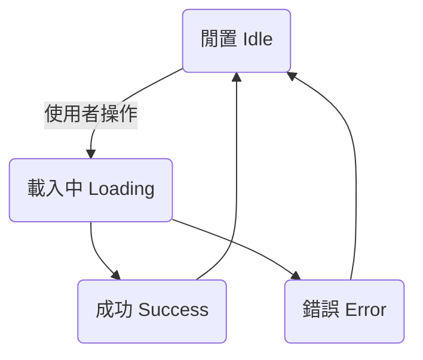

+++
title = "Day 26: 【前端 #7】用戶體驗的最後一哩路：優雅地處理載入與錯誤"
date = 2025-09-14
slug = "2025iThomeIronmanDay26"
dates = ["2025-09-14"]
tags = ["2025iThomeIronman", "Gemini", "Frontend", "UX", "State Machine", "Error Handling"]
series = ["2025iThomeIronman"]
categories = ["前端開發"]
weight = 26
prev_post_slug = "2025iThomeIronmanDay25"
next_post_slug = "2025iThomeIronmanDay27"
draft = false
description = "今天我們將為 App 注入「同理心」，教它如何與使用者溝通，優雅地處理「載入中」和「錯誤」狀態。"
+++

安安，我是 ChiYu！

昨天，我們的 App 經歷了一次完全體的進化！我們在一天之內，火力全開，搞定了核心的 CRUD 功能。我們的 App 不僅能思考、能表達，現在更擁有了完整的 **行動能力**。

但是，一個專業的產品，不只需要考慮「成功」的情境，更需要優雅地處理「等待」與「失敗」。想像一下，你點擊「儲存」後，如果因為網路不好，畫面卡住不動長達五秒，你會不會以為 App 當機了，然後狂點好幾次？如果伺服器剛好在維護，畫面直接崩潰，你是不是會立刻對這個 App 失去信心？一個沉默的 App 是一個「無禮」的 App，它不尊重使用者的時間和情緒。

今天，我們就要來補上這至關重要的**用戶體驗最後一哩路**。我們將扮演一位「用戶體驗工程師」，為我們的 App 注入「同理心」，教它如何與使用者溝通，優雅地處理「載入中」和「錯誤」狀態，讓它從一個「能用」的產品，進化成一個 **「好用」** 且 **「貼心」**的產品！

---

## Part 1：前端心法：從「單一路徑」到「UI 狀態機」

一個業餘的 App 只會為「成功」而設計，也就是我們常說的「快樂路徑 (Happy Path)」。但一個專業的 App，會將每一次互動都視為一個 **「狀態機 (State Machine)」**。這意味著，我們的 UI 介面，在任何時刻，都只會處於一個明確、可預測的狀態中。

對於資料獲取這個常見的場景，一個最基本的狀態機至少包含以下幾個狀態：

1. **閒置狀態 (Idle)**：互動發生前的初始狀態。
2. **等待狀態 (Loading)**：從使用者點擊，到後端伺服器回應之前的這段時間。這是最容易被忽略，卻也最影響使用者感受的環節。一個好的 App 會在這時給出明確的回饋（例如轉圈動畫），告訴使用者：「我知道了，正在處理中，請稍候」，而不是讓使用者在原地焦慮地猜測。
3. **成功狀態 (Success)**：我們昨天做的所有功能，都屬於這個狀態。
4. **錯誤狀態 (Error)**：當網路中斷、伺服器出錯時，就會進入這個狀態。一個好的 App 會給出清晰、友善的錯誤提示，引導使用者解決問題，而不是直接崩潰或顯示一堆看不懂的程式碼。

我們可以將這個流程視覺化：



我們今天的目標，就是要讓我們的「狀態中心 (`State`)」能夠完整地描述這個狀態機，並讓我們的「渲染引擎 (`Render Function`)」能夠忠實地將每一個狀態呈現出來。

## Part 2：Vibe Coding 實戰：升級我們的「狀態管理」核心

好了，理論武裝完畢！讓我們進入 gemini chat 模式，指揮 AI 為我們的狀態管理系統，進行一次全面的升級。

### 【魔法詠唱：注入同理心】

我們將用一個更全面的 Prompt，一次性地指揮 AI 完成整個重構任務。

```markdown
# 角色 (Role)
你是一位資深的 JavaScript 前端架構師，是「用戶體驗工程 (UX Engineering)」的倡導者與實踐者。你堅信一個優秀的 UI 不僅要功能完整，更要成為一個能與使用者清晰溝通的「狀態機 (State Machine)」，在任何情況下都能提供明確的反饋、引導與安撫。

# 目標 (Objective)
請對我現有的 `@frontend/script.js` 和 `@frontend/style.css` 進行一次以「用戶體驗」為核心的架構性重構。你需要升級我們的狀態管理系統與渲染引擎，使其能夠完美地處理「載入中 (Loading)」與「錯誤 (Error)」這兩種關鍵狀態，並提供 **具備行動呼籲 (Actionable)** 的介面反饋。

# 上下文與關鍵資訊 (Context & Key Information)
* **目標重構檔案 (JS)**: `@frontend/script.js`
* **目標修改檔案 (CSS)**: `@frontend/style.css`
* **依賴模組**: `@frontend/api.js`

# 核心理念：打造一個具備同理心的 UI 狀態機
我們的 UI 應該在任何時刻都只處於一個明確的狀態。當與後端進行通訊時，這個狀態機至少包含：`閒置 (Idle)` -> `等待 (Loading)` -> `成功 (Success)` 或 `失敗 (Error)`。我們的重構目標，就是要讓 `state` 物件能完整描述這個流程，並讓 `render` 函式能忠實地將每個狀態呈現給使用者。

---
## 產出格式與要求 (Your Task & Output Requirements)

### **Part 1: 重構 `script.js` (升級狀態管理與渲染)**

1.  **升級「狀態中心 (`state`)」**:
    * 在現有的 `habits` 屬性之外，新增 `isLoading: false` 和 `error: null`。`error` 最好是一個物件，例如 `{ message: '讀取失敗' }`，以便未來擴充。

2.  **升級「主渲染引擎 (`render`)」**:
    * **重構渲染邏輯**: 主 `render` 函式現在需要根據 `state` 的不同組合來渲染**整個應用程式**的畫面，順序如下：
        1.  **載入狀態**: 如果 `state.isLoading` 為 `true`，則在列表容器中渲染一個「載入中」的指示器（見 Part 2 CSS 要求），並**禁用**所有主要操作按鈕（如「新增習慣」、「儲存」等）。
        2.  **錯誤狀態**: 如果 `state.error` 存在，則在列表容器中渲染一個「錯誤」提示元件，其中需包含錯誤訊息**和一個可點擊的「重試」按鈕** (`<button class="retry-button">`)。
        3.  **空狀態**: 如果 `state.habits` 為空且無錯誤，渲染「空狀態」提示。
        4.  **成功狀態**: 最後，才渲染完整的習慣列表。

3.  **升級所有「API 互動函式」(Pessimistic Updates)**:
    * **改造 `loadInitialData`**:
        * 函式一開始就呼叫 `setState({ isLoading: true, error: null })`。
        * 在 `try` 成功後和 `catch` 捕獲錯誤後，都要記得呼叫 `setState({ isLoading: false, ... })` 來結束載入狀態。
    * **改造 `handleAddHabit` / `handleDeleteHabit` 等所有修改操作**:
        * 在呼叫 API **之前**，進入 `isLoading` 狀態: `setState({ isLoading: true })`。
        * 在 API 操作**完成後**（無論成功或失敗），都要結束 `isLoading` 狀態: `setState({ isLoading: false, ... })`。
    * **新增事件監聽**:
        * 使用**事件委派**，為 `.retry-button` 加上點擊事件監聽器，點擊後應重新呼叫 `loadInitialData()`。

### **Part 2: 修改 `style.css` (追加 UI 反饋樣式)**

* **追加新樣式**: 在檔案的末尾，使用註解分區，追加以下新樣式。
* **載入中指示器 (`.loading-spinner`)**:
    * 請實作一個**純 CSS 的載入中 spinner 動畫**。可以使用 `border` 和 `border-radius` 畫一個圓圈，並讓其中一邊的 `border-color` 透明，再搭配 `@keyframes` 實現旋轉動畫。
* **錯誤訊息面板 (`.error-message`)**:
    * 設計一個清晰的錯誤提示框。
    * 應有柔和的紅色系背景（例如 `--color-danger-light`），和深紅色的文字與邊框（例如 `--color-danger-dark`）。
    * 包含足夠的內距 (`padding`) 和圓角 (`border-radius`)。
    * 為內部的「重試」按鈕 `.retry-button` 設計清晰的樣式。
* **禁用狀態 (`:disabled`)**:
    * 為按鈕的 `:disabled` 偽類，追加一個通用的樣式，例如降低透明度 (`opacity: 0.6;`) 和禁用滑鼠指標 (`cursor: not-allowed;`)，以提供明確的視覺反饋。
```

## Part 3：設計理念深度剖析

AI 完成操作後，讓我們來仔細品味一下我們煥然一新的 `script.js` 和 `style.css`。

### 【AI 生成的 script.js (精華版)】

```javascript
// ... import ...

// 1. 升級後的狀態中心 (State Center)
const state = {
    habits: [],
    isLoading: false, 
    error: null,
};

// ... 元素選擇器 ...

// 2. 升級後的渲染引擎 (Render Engine)
function renderHabitList() {
    habitListContainer.innerHTML = "";

    if (state.isLoading) {
        habitListContainer.innerHTML = `<div class="loading-spinner"></div><p>載入中...</p>`;
        return;
    }
    if (state.error) {
        habitListContainer.innerHTML = `
            <div class="error-message">
                <p>${state.error}</p>
                <button class="retry-button">重試</button>
            </div>`;
        return;
    }
    
    // ... 後續的空狀態和列表渲染邏輯 ...
}

// 3. 升級後的 API 互動函式 (以新增為例)
async function handleAddHabit(event) {
    event.preventDefault();
    const habitName = newHabitInput.value.trim();
    if (!habitName) return;

    setState({ isLoading: true });

    try {
        const newHabit = await addHabit({ name: habitName });
        if (newHabit) {
            setState({ 
                habits: [newHabit, ...state.habits],
                isLoading: false,
            });
        } else {
            throw new Error("API did not return a new habit.");
        }
    } catch (err) {
        setState({
            error: "新增習慣失敗，請稍後再試。",
            isLoading: false,
        });
    }
}
```

### 設計解讀 (WHY WE DO THIS):

- **state 物件：狀態機的「儀表板」**
    * **WHY**：我們升級後的 state 物件 ({ habits, isLoading, error })，就像是我們 UI 狀態機的儀表板。它不再只儲存「數據 (habits)」，更儲存了「當前情境 (isLoading, error)」。
- **render() 函式：儀表板的「忠實呈現者」**
    * **WHY**：升級後的 render 函式，職責依然單純：無條件地相信並呈現儀表板上的資訊。它開頭的判斷，確保了在處理數據之前，優先向使用者傳達最重要的情境資訊。
- **API 函式：狀態機的「操作桿」**
    * **WHY**：像 handleAddHabit 這樣的函式，現在扮演了「狀態操作桿」的角色。注意看函式裡的流程：`setState({ isLoading: true }) -> await apiCall() -> setState({ isLoading: false, ... })`。這是一個完整、健壯的狀態轉換流程。

## Part 4：成果驗證：一個體貼、健壯的 App！

### 測試載入狀態：
1. 打開瀏覽器開發者工具 (F12)，切換到 **Network (網路)** 頁籤。
2. 在 **Throttling (節流)** 選項中，選擇 `Slow 3G`。
3. 現在，刷新你的頁面或嘗試新增一個習慣。你會清楚地看到，在習慣列表出現之前，我們先看到了優雅的「載入中」提示！

### 測試錯誤狀態：
1. 關掉你本地的 Flask 後端伺服器。
2. 回到瀏覽器，刷新頁面。
3. 這次，因為前端無法連接到後端，畫面不會崩潰，而是會優雅地顯示我們設計的「讀取資料失敗」的錯誤訊息！

## Part 5：提交我們 App 的「同理心」

- **Commit 訊息**: `feat(frontend): implement loading and error state handling for better UX`
- **Commit & Push**！

## 結語：從能用到好用，下一步是兌現承諾

再次恭喜！今天，我們的 App 學會了「同理心」。它不再是一個只會執行命令的冰冷機器，而是一個懂得在使用者等待時給予安撫、在發生意外時給予解釋的貼心夥伴。

我們已經為使用者體驗打下了堅實的基礎。現在，是時候兌現我們在《專案章程》中許下的最終承諾了。

明天，我們將整合一個強大的圖表庫，用 Chart.js 實現我們 App 的核心價值——「關聯性洞察」！
