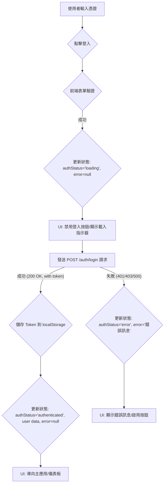
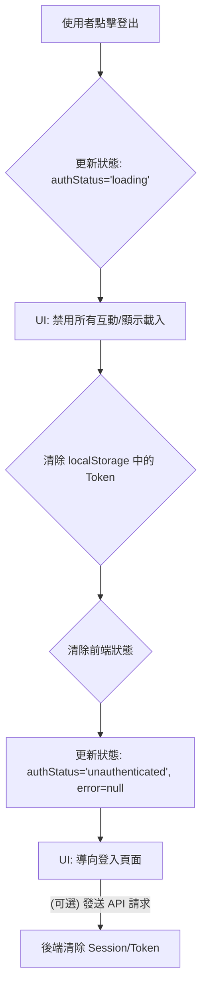
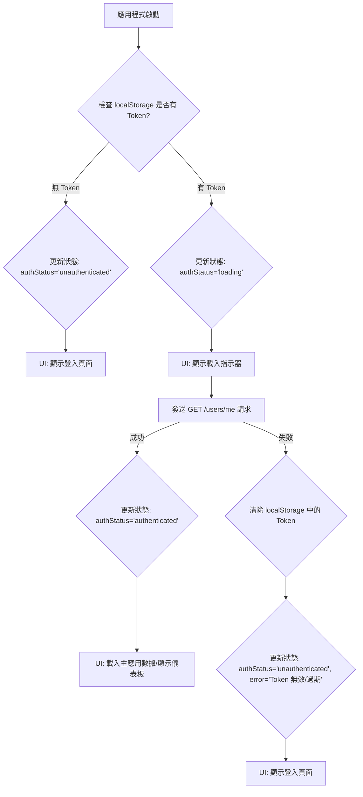

+++
title = "Day 29: 【文件 #9】專案的守衛：用 Gemini 規劃「前端認證流程」"
date = 2025-09-17
slug = "2025iThomeIronmanDay29"
dates = ["2025-09-17"]
tags = ["2025iThomeIronman", "Gemini", "Frontend", "Authentication", "JWT", "Security"]
series = ["2025iThomeIronman"]
categories = ["設計文件"]
weight = 29
prev_post_slug = "2025iThomeIronmanDay28"
next_post_slug = "2025iThomeIronmanDay30"
draft = false
description = "今天我們將進行第二個前端的 DDD 循環，扮演「資安架構師」，為專案撰寫一份清晰、專業的「前端認證流程規格書」。"
+++

安安，我是 ChiYu！

昨天，我們成功地兌現了對使用者的最終承諾，將冰冷的數據轉化為了富有情感的、能啟發洞察的視覺化故事。我們的 App 核心價值已然確立。

但是，我們的 App 現在還像是一個 **沒有門鎖的豪宅**。雖然內部裝潢精美、功能強大，但任何人都可以隨意進出，這對於一個旨在儲存使用者私密心情與習慣數據的應用來說，是絕對不可接受的。

**使用者認證 (Authentication)** 流程，是任何嚴肅 Web 應用的基石。它複雜、涉及安全性、且牽一髮而動全身。因此，我們 **絕對不能**憑感覺去寫！

今天，我們將進行第二個前端的 DDD 循環！我們將扮演一位「資安架構師」，與 Gemini 一同腦力激盪，為這個最關鍵的功能，撰寫一份清晰、專業的**「前端認證流程規格書」**。

## Part 1：前端心法：在寫 Code 前，先成為半個資安專家

在我們觸碰任何跟認證相關的程式碼之前，我們必須先在腦中建立起清晰的資安模型。這不僅僅是「使用者體驗」的問題，更是「使用者信任」的基石。

### 1.1 核心觀念：認證 (Authentication) vs. 授權 (Authorization)

首先，要釐清兩個最常被搞混的概念：

- **認證 (Authentication - 你是誰？)**：這個過程是在 **驗證你的身份**。就像你進入一棟大樓，需要出示你的身份證或門禁卡，向保全證明「我就是住戶 ChiYu」。 **登入**這個動作，就是最典型的認證。
- **授權 (Authorization - 你能做什麼？)**：這個過程是在你 **通過認證後**， **決定你有哪些權限**。保全確認了你是 ChiYu 後，他還需要知道，你的門禁卡只能打開你家的門，不能打開別人家或頂樓機房的門。在 App 中，這可能意味著普通使用者只能讀取自己的資料，而管理員 (Admin) 則可以讀取所有人的資料。

### 1.2 現代 Web 的通行證：JWT (JSON Web Token)

在現代 Web App 中，我們如何實現無狀態 (Stateless) 的認證呢？答案就是 **JWT**。

你可以把 JWT 想像成一張 **蓋了章的「數位通行證」**。當你用帳號密碼成功登入後，伺服器會發給你一張 JWT。這張通行證本身包含了一些資訊（例如你是誰、你的權限是什麼），並且經過伺服器的 **數位簽章**，確保它沒有被偽造。

之後，你每次要向伺服器請求資料時，只需要在請求中附上這張通行證，伺服器看到上面有自己蓋的章，就知道你是合法的使用者，而不需要每次都重新去資料庫查驗你的帳號密碼。

### 1.3 OAuth 2.0：安全的「授權代理」

你一定用過「透過 Google / Facebook 登入」的功能。這背後，就是 **OAuth 2.0** 的功勞。

OAuth 2.0 本質上不是一個「認證」協議，而是一個 **「授權 (Authorization)」**框架。它的核心思想是 **「安全的代理授權」**。

> 比喻來說：
假設你的 App (我們的 MindTrack) 是一個需要你家（Google 帳戶）鑰匙的「清潔服務公司」。
> 
> - **不安全的作法**：你直接把你的 Google 帳號密碼告訴 MindTrack。這太危險了！MindTrack 不僅能打掃你的房間（讀取基本資料），還能動用你的存款、看你的私密信件！
> - **OAuth 2.0 的作法**：你想請 MindTrack 來打掃時，MindTrack 會把你帶到 Google 的「物業管理處」。你在這裡向 Google 確認：「是的，我同意讓 MindTrack 進入我家，但 **只授權**他打掃客廳（讀取你的基本個人資料），絕對不准進臥室（讀取你的信件）！」
> 
> Google 確認後，不會把你的「萬能鑰匙」給 MindTrack，而是會給他一張 **有特定權限、有時效性**的「臨時通行證」。MindTrack 拿著這張臨時通行證，就可以來幫你打掃客廳了。
> 

雖然我們的 MVP 不會實作 OAuth 2.0，但理解這個觀念，是你邁向專業開發者的重要一步。

## Part 2：Vibe Coding 實戰：撰寫我們的「安全白皮書」

好了，理論武裝完畢！讓我們進入 `gemini chat` 模式，指揮 AI 為我們撰寫這份至關重要的安全規格書。

### 【魔法詠唱：設計認證流程】

```markdown
# 角色 (Role)
你是一位頂尖的資安架構師與資深前端工程師，是 Web 安全、JWT (JSON Web Token) 認證機制、前端路由管理與 API 客戶端設計的權威專家。你致力於在確保安全性的前提下，打造無縫、穩固且可擴展的使用者認證體驗。

# 目標 (Objective)
請根據我提供的專案上下文，為我們的 Web App 設計一份專業、完整、且具備高度可執行性的**「前端認證架構藍圖 (Frontend Authentication Architectural Blueprint)」**。這份文件將作為開發團隊實現所有安全相關功能的唯一真理來源。

# 上下文與關鍵資訊 (Context & Key Information)
* **核心需求**: 我們需要為 App 實現使用者故事 #1：「使用者註冊/登入」。(`@docs/USER_STORIES.md`)
* **後端契約**: 我們後端的 `/auth/login` 和 `/auth/register` 端點，在成功後會返回一個包含 `accessToken` (JWT) 的 JSON 物件。(`@docs/API_SPEC.yml`)
* **核心挑戰**: 設計一個既安全又具備良好使用者體驗的前端認證系統。

# 產出格式與要求 (Your Task & Output Requirements)
**請生成一份專業的 Markdown 文件，並嚴格遵循以下大綱結構：**

### 1. **核心原則與架構決策**
* **技術選型與權衡 (Tech Choices & Trade-offs)**:
    * **Token 儲存策略**: 明確我們將選擇 `localStorage` 來儲存 JWT Token。 **請深入分析此決策**：闡述其優點（API 簡單、跨分頁共享），並 **詳細列出其主要安全風險（易受 XSS 攻擊）及對應的基礎緩解措施**（例如：內容安全策略 CSP、輸入淨化）。
    * **API 客戶端攔截器 (API Client Interceptor)**: 說明我們將 **必須**建立一個集中的 `fetch` 封裝函式或使用類似 `axios` 的攔截器。其核心職責是：在 **每個**發出的請求中，自動從 `localStorage` 讀取 Token 並將其附加到 `Authorization` 標頭中。

### 2. **前端認證狀態機 (Frontend Auth State Machine)**
* 說明我們將在前端的 `state` 物件中，維護一個完整的認證狀態機，而不僅僅是一個布林值。
* **狀態定義**:
    * `authStatus: 'idle' | 'loading' | 'authenticated' | 'unauthenticated' | 'error'`
    * `user: { id, name, email } | null`
    * `error: string | null`
* **設計理由**: 簡述為何使用狀態機能夠更優雅地處理 UI 變化（例如，在 `loading` 狀態下禁用登入按鈕）。

### 3. **核心流程圖 (Core Flowcharts)**
* 使用 Mermaid.js 的 `graph TD` 語法，為以下三個核心流程，分別繪製包含 **UI 狀態變化**的清晰流程圖：
    * **使用者登入流程**: 需包含「更新狀態為 loading」、「禁用按鈕」、「API 請求」、「成功後儲存 Token」、「更新狀態為 authenticated」、「失敗後更新狀態為 error」等節點。
    * **使用者登出流程**: 需包含「清除 Token」、「清除本地狀態」、「API 請求(可選)」、「重新導向」。
    * **應用程式啟動時的認證檢查流程**: 需包含「檢查本地 Token」、「驗證 Token 有效性(可選)」、「設定初始狀態」。

### 4. **路由與授權：路由守衛 (Routing & Authorization: Route Guards)**
* **概念闡述**: 深入淺出地解釋什麼是「路由守衛」，並使用「每個房間門口的保全」的比喻。
* **職責定義**:
    * **公開路由 (Public Routes)**: 如 `/login`, `/register`，任何人都可以訪問。
    * **私有路由 (Private Routes)**: 如 `/dashboard`, `/settings`，必須在進入前由「路由守衛」檢查 `state.isAuthenticated` (或 Token 的有效性)。
    * **無權限處理**: 若檢查失敗，路由守衛必須立即將使用者**重新導向 (Redirect)** 至登入頁面。

### 5. **錯誤處理與 Token 過期策略**
* **集中處理**: 定義 API 客戶端攔截器的另一項核心職責：**攔截 API 回應**。
* **標準流程**: 當攔截器偵測到後端返回 `401 Unauthorized` 狀態碼時，它必須觸發一個**全域的登出程序**（清除 Token、重設狀態、重新導向到登入頁），而無需每個元件單獨處理。

### 6. **最終產出**
* 將以上所有內容，生成到 `docs/AUTH_FLOW.md` 檔案中。
```

## Part 3：審核 AI 產出的「安全白皮書」

AI 完成操作後，讓我們來仔細品味一下這份由我們共同創作的、專業的「安全設計圖」。

```markdown
# 前端認證架構藍圖 (Frontend Authentication Architectural Blueprint)

- **文件版本**: 1.0
- **作者**: Gemini (資安架構師 / 資深前端工程師)
- **狀態**: `草案`

---

## 1. 核心原則與架構決策

### 1.1. 技術選型與權衡 (Token 儲存策略)

我們將選擇 `localStorage` 來儲存 JWT (JSON Web Token)。此決策基於以下考量：

-   **優點**:
    -   **API 簡單易用**: `localStorage` 提供直觀的 `setItem()`, `getItem()`, `removeItem()` 方法，易於開發者操作。
    -   **跨分頁共享**: 儲存在 `localStorage` 中的 Token 可以被同源 (same-origin) 的所有瀏覽器分頁共享，方便使用者在多個分頁間保持登入狀態。
    -   **持久化儲存**: Token 會在瀏覽器關閉後依然存在，使用者無需每次開啟瀏覽器都重新登入，提升使用者體驗。

-   **主要安全風險 (XSS 攻擊)**:
    -   `localStorage` 中的數據**容易受到跨站腳本 (XSS) 攻擊**。一旦攻擊者成功在頁面中注入惡意 JavaScript 程式碼，他們就可以直接存取 `localStorage` 中的所有數據，包括 JWT Token。攻擊者獲取 Token 後，即可冒充使用者發送請求，造成會話劫持 (Session Hijacking)。

-   **基礎緩解措施**:
    -   **內容安全策略 (Content Security Policy, CSP)**: 實施嚴格的 CSP，限制頁面可以載入的腳本、樣式和其他資源的來源。這能有效防禦大多數 XSS 攻擊，因為它阻止了惡意腳本的載入和執行。
    -   **輸入淨化 (Input Sanitization)**: 對所有來自使用者或外部來源的輸入數據進行嚴格的驗證、過濾和淨化，防止惡意程式碼（如 `<script>` 標籤）被儲存到資料庫或直接顯示在頁面上。
    -   **輸出編碼 (Output Encoding)**: 在將任何來自使用者或不可信來源的數據渲染到 DOM 之前，對其進行適當的編碼（例如 HTML 實體編碼）。這可以防止瀏覽器將惡意數據解釋為可執行程式碼。
    -   **Token 有效期短**: 設定 JWT 的有效期限盡可能短（例如 15-30 分鐘）。即使 Token 被盜，其生命週期也有限，降低了攻擊的窗口。應搭配 Refresh Token 機制來無感刷新 Token，但 Refresh Token 應儲存在更安全的 `HttpOnly` Cookie 中，這屬於後端和更複雜的前端範疇。
    -   **不儲存敏感資訊**: JWT 的 Payload 應只包含非敏感的公開資訊（如使用者 ID、角色），不應包含密碼、信用卡號等敏感數據。

### 1.2. API 客戶端攔截器 (API Client Interceptor)

我們將在 `api.js` 模組中建立一個集中的 `apiFetch` 封裝函式（已實現）。其核心職責是：在**每個**發出的請求中，自動從 `localStorage` 讀取 Token 並將其附加到 `Authorization: Bearer <token>` 標頭中。這確保了所有需要認證的 API 請求都能自動攜帶 Token，簡化了業務邏輯的開發。

---

## 2. 前端認證狀態機 (Frontend Auth State Machine)

我們將在前端的 `state` 物件中，維護一個完整的認證狀態機，而不僅僅是一個布林值。這使得 UI 能夠更精確地反映認證過程中的不同階段，提供更優質的使用者體驗。

-   **狀態定義**:
    -   `authStatus: 'idle' | 'loading' | 'authenticated' | 'unauthenticated' | 'error'`
        -   `idle`: 應用程式初始狀態，或認證流程未啟動。
        -   `loading`: 正在進行登入、註冊或 Token 驗證等認證相關的非同步操作。
        -   `authenticated`: 使用者已成功登入並通過驗證，具備訪問受保護資源的權限。
        -   `unauthenticated`: 使用者未登入，或其 Token 無效/已過期，無法訪問受保護資源。
        -   `error`: 在認證過程中發生了錯誤（例如網路問題、憑證錯誤）。
    -   `user: { id, name, email } | null`: 儲存已認證使用者的基本資訊。在 `unauthenticated` 或 `error` 狀態下為 `null`。
    -   `error: string | null`: 儲存認證過程中發生的具體錯誤訊息，用於向使用者顯示。

-   **設計理由**:
    -   **精確的 UI 反饋**: 能夠根據 `authStatus` 精確地控制 UI 元素（例如，在 `loading` 狀態下禁用登入按鈕並顯示載入指示器，在 `error` 狀態下顯示錯誤訊息）。
    -   **清晰的邏輯流**: 狀態機使得認證流程的邏輯更加清晰和可預測，減少了條件判斷的複雜性。
    -   **優雅的錯誤處理**: 能夠將認證錯誤與其他應用程式錯誤區分開來，並提供專門的處理和顯示。

---

## 3. 核心流程圖 (Core Flowcharts)

以下流程圖使用 Mermaid.js 語法，展示了認證相關的核心流程及其伴隨的 UI 狀態變化。

### 3.1. 使用者登入流程



### 3.2. 使用者登出流程



### 3.3. 應用程式啟動時的認證檢查流程



---

## 4. 路由與授權：路由守衛 (Routing & Authorization: Route Guards)

### 4.1. 概念闡述

「路由守衛」就像是應用程式中每個「房間」門口的保全。當使用者嘗試進入某個「房間」（即訪問某個路由或頁面）時，保全會先檢查他們是否具備進入的「通行證」（即是否已認證或具備特定權限）。如果沒有，保全就會阻止他們進入，並將他們帶到指定的地方（例如登入頁面）。

### 4.2. 職責定義

-   **公開路由 (Public Routes)**:
    -   例如 `/login`, `/register`。這些路由不需要任何認證，任何人都可以訪問。
    -   路由守衛會確保已登入的使用者不會被困在這些頁面。如果 `authStatus` 為 `authenticated`，則會自動將使用者導向主應用（例如儀表板）。

-   **私有路由 (Private Routes)**:
    -   例如 `/dashboard`, `/settings`, `/review`。這些路由包含敏感或個人化數據，必須在進入前由「路由守衛」檢查 `state.authStatus` 是否為 `authenticated`。

-   **無權限處理**:
    -   若檢查失敗（即 `authStatus` 不是 `authenticated`），路由守衛必須立即將使用者**重新導向 (Redirect)** 至登入頁面，並可選地附帶一個提示訊息，告知使用者需要登入才能訪問該頁面。

---

## 5. 錯誤處理與 Token 過期策略

### 5.1. 集中處理

`api.js` 中的 `apiFetch` 函式將作為 API 客戶端攔截器，負責攔截所有從後端返回的 API 回應。這是處理 Token 過期和認證錯誤的關鍵點，因為它允許我們在單一位置處理這些全域性的問題，而無需在每個 API 呼叫處重複邏輯。

### 5.2. 標準流程

當 `apiFetch` 偵測到後端返回 `401 Unauthorized` 狀態碼時，這表示當前使用的 Token 無效或已過期。此時，`apiFetch` 必須觸發一個**全域的登出程序**：

1.  **清除 `localStorage` 中的 `authToken`**: 移除無效的 Token，防止其被再次使用。
2.  **重設前端 `state` 中的認證相關狀態**: 將 `isAuthenticated` 設為 `false`，`user` 設為 `null`，`authStatus` 設為 `unauthenticated`。這會立即更新 UI，反映使用者已登出。
3.  **將使用者重新導向到登入頁面**: 確保使用者被帶到正確的入口點，並可選地顯示一個訊息，告知他們會話已過期。

這樣做的好處是，所有元件都不需要單獨處理 `401` 錯誤，只需專注於自身的業務邏輯。任何 `401` 錯誤都會自動觸發一個安全且一致的登出流程。
```

## Part 4：提交我們的「安全設計圖」

1. **Commit 訊息**: `docs(frontend): Create authentication flow specification`
2. **Commit & Push**！

### 結語：從「功能」到「安全」

再次恭喜！今天，我們為 App 的安全性，打下了最堅實的理論基礎。我們沒有憑感覺去處理這個複雜的流程，而是再次透過 **「文件驅動」**，將所有可能的路徑與邏輯，都預先規劃得一清二楚。

有了這份精密的「安全白皮書」，我們接下來的開發工作將會變得無比順暢。明天，我們將正式拿起工具，**嚴格依據今天的這份流程圖** ，將我們的APP安全性補齊。