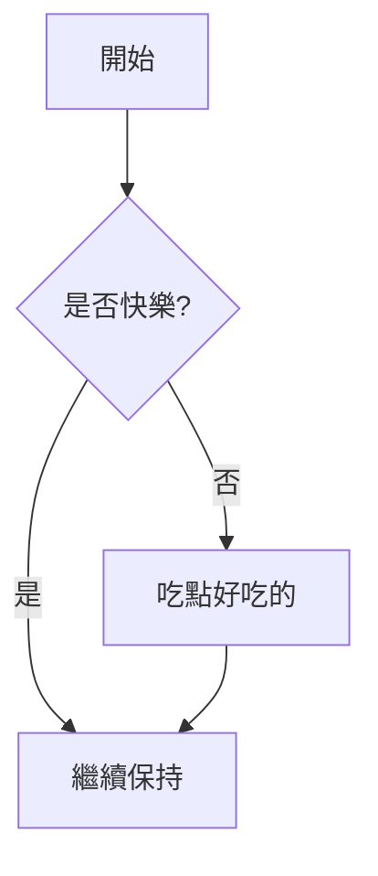
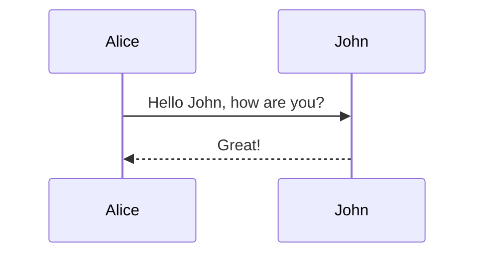
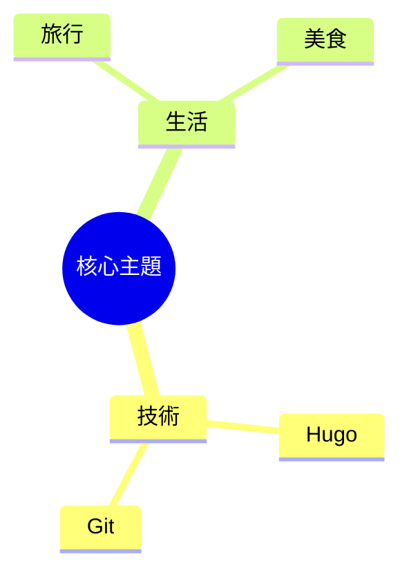
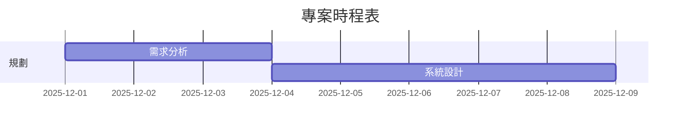

+++
title = "【撰寫指南】Hugo 文章 Front Matter 參數詳解"
date = 2025-12-17T16:50:00+08:00
slug = "hugo-front-matter-guide"
dates = ["2025-12-17"]
tags = ["Hugo", "Documentation", "Guide"]
series = ["Hugo 開發紀錄"]
categories = ["開發工具"]
weight = 1
draft = false
showToc = false
description = "這是一篇給自己看的備忘錄，詳細記錄了撰寫新文章時所需的參數設定與用途。"
+++

這篇文章是為了快速查閱 Front Matter (文章開頭的設定區塊) 而建立的範本。

## 完整範本 (可以直接複製)

```toml
+++
title = "文章標題" 
date = 2025-12-17T16:00:00+08:00
slug = "自訂文章網址-Slug" 

# 顯示於側邊欄日曆的日期 (通常與 date 相同)
dates = ["2025-12-17"] 

# 標籤與系列
tags = ["Tag1", "Tag2"] 
series = ["系列名稱"] 
categories = ["分類名稱"]

# 系列文章排序 (數字越小越前面)
weight = 10

# 手動指定上下篇 (選填，若不填則依時間自動排序)
# 填寫對應文章的 Slug 或 檔名 (不含副檔名)
prev_post_slug = ""
next_post_slug = ""

# 是否為草稿 (true 則不會被發布)
draft = true
+++
```

## 參數詳細說明

### 基礎設定

*   **`title`**: 文章的主標題。
*   **`date`**: 發布日期。Hugo 會根據這個日期進行排序。
*   **`slug`**: 自定義網址的尾端。例如設為 `my-post`，文章網址就會是 `.../posts/my-post/`。若不設定，預設會使用檔名。
*   **`draft`**: 設為 `true` 代表草稿，`hugo server` 預設看得到，但部署到 GitHub Pages 時會被隱藏。寫完確認沒問題後請改為 `false`。

### 分類與關聯

*   **`series`**: **重要！** 設定系列名稱。相同系列名稱的文章會自動彙整在系列區塊中。
*   **`weight`**: 這是**系列文章專用**的排序權重。
    *   Day 1 設為 `1`
    *   Day 2 設為 `2`
    *   以此類推。
*   **`tags`**: 文章標籤，用於搜尋與分類。
*   **`dates`**: 這是一個特殊的陣列欄位，用於您的「日曆/歸檔」功能。

### 導覽控制 (選填)

這兩個欄位用於當您想要**強制指定**「上一篇」與「下一篇」連結時使用。

*   **`prev_post_slug`**: 上一篇文章的 Slug 或檔名。
*   **`next_post_slug`**: 下一篇文章的 Slug 或檔名。

> **小技巧**：如果您的系列文章都有設定 `weight`，通常系統會自動正確排序，不需要手動設定這兩個欄位。這主要用於跨系列的連結或修正排序錯誤。

## 如何自動產生這個範本？

不需要每次都複製貼上！請參考專案中的 `archetypes/posts.md` 檔案。

只要在終端機執行：

```bash
hugo new posts/2025/12/my-new-post.md
```

系統就會自動根據 `archetypes/posts.md` 的內容，幫您產生好上述的所有欄位！

---

## 常見 Markdown 語法速查

這裡列出寫作時最常用的語法，忘記時可以隨時回來複製。

### 1. 標題 (Headers)

```markdown
# H1 最大標題 (通常用於文章 Title，內文不建議用)
## H2 二級標題 (章節)
### H3 三級標題 (小節)
#### H4 四級標題 (細項)
```

### 2. 文字樣式 (Text Styling)

```markdown
**粗體文字**
*斜體文字*
~~刪除線~~
`行內程式碼 (Inline Code)`
```

**預覽：**
**粗體文字** | *斜體文字* | ~~刪除線~~ | `const a = 1;`

### 3. 列表 (Lists)

**無序列表** (使用 `*`, `+` 或 `-`)：
```markdown
- 項目一
- 項目二
  - 子項目 A (縮排兩個空白)
  - 子項目 B
```

**有序列表** (使用數字加點)：
```markdown
1. 第一步
2. 第二步
3. 第三步
```

### 4. 程式碼區塊 (Code Blocks)

請使用三個反引號 ``` 包裹程式碼，並在第一行指定語言以啟用高亮。

    ```javascript
    function sayHello() {
        console.log("Hello, World!");
    }
    ```

    ```csharp
    public class Program {
        public static void Main() {
            Console.WriteLine("Hello C#");
        }
    }
    ```

### 5. 引用 (Blockquotes)

用於註解、警告或引用他人文字。

```markdown
> 這是引用文字
> 可以多行
```

**預覽：**
> 這是引用文字
> 可以多行

### 6. 連結與圖片

```markdown
[顯示文字](https://www.google.com)


```

### 7. 表格 (Tables)

```markdown
| 欄位 1 | 欄位 2 | 欄位 3 |
| :--- | :---: | ---: |
| 置左 | 置中 | 置右 |
| 內容 A | 內容 B | 內容 C |
```

### 8. 分隔線

使用三個以上的 `-` 或 `*`。

```markdown
---
```

### 9. 流程圖與心智圖 (Mermaid)

本部落格已支援 Mermaid.js。直接使用 \```mermaid 區塊即可繪製。

#### 流程圖 (Flowchart)

**語法：**
```markdown

```

**預覽結果：**


---

#### 時序圖 (Sequence Diagram)

**語法：**
```markdown

```

**預覽結果：**


---

#### 心智圖 (Mindmap)

**語法：**
```markdown

```

**預覽結果：**


---

#### 甘特圖 (Gantt)

**語法：**
```markdown

```

**預覽結果：**


